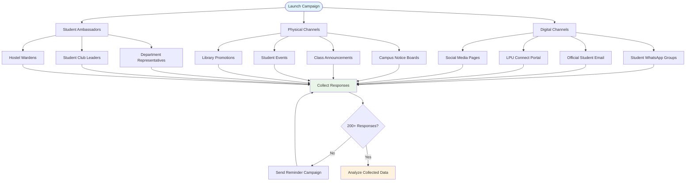
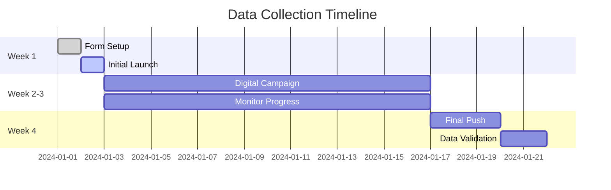
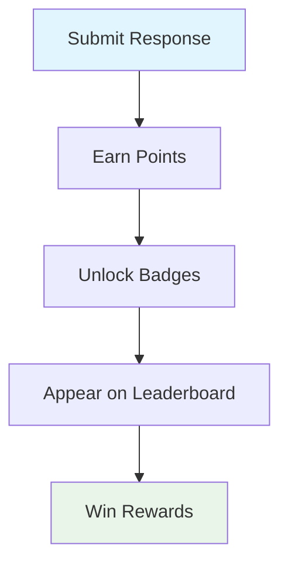
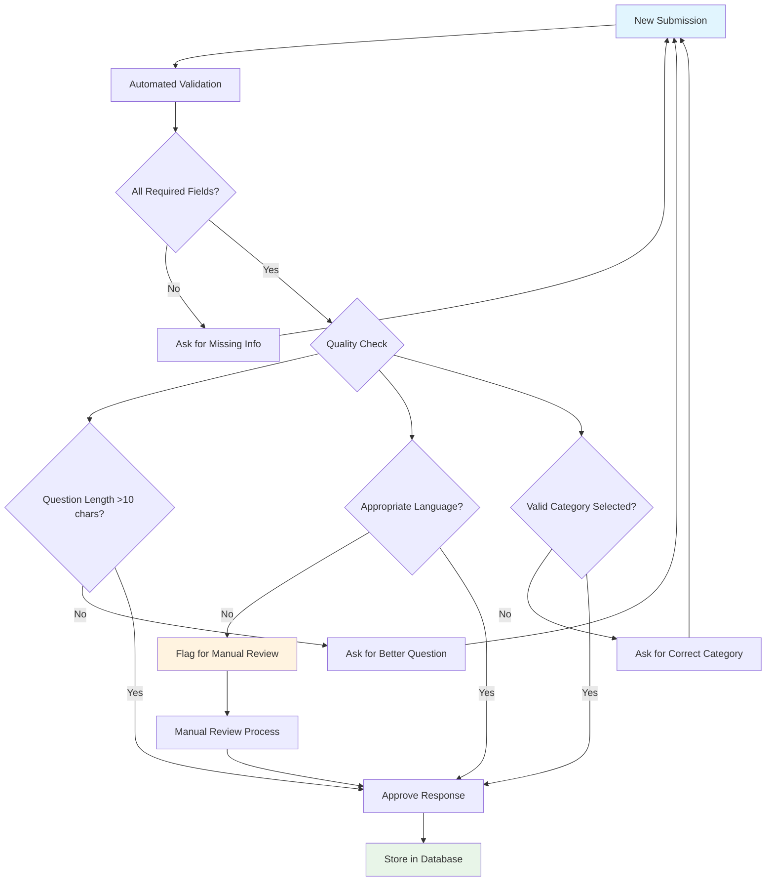
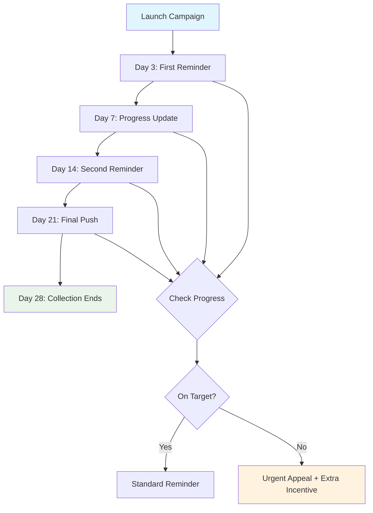

# 📊 Data Collection Guide for LPU Query Chatbot

## 🎯 Data Collection Objectives

Collect authentic student queries from across all LPU departments to build a comprehensive dataset that reflects real student needs and questions.

---

## 📋 Google Form Structure

### Form Fields Specification

| Field Name | Type | Required | Description | Validation |
|------------|------|----------|-------------|------------|
| Name / Roll No | Short answer | ❌ | Optional for anonymity | None |
| Program / Department | Dropdown | ✅ | Student's academic program | Predefined list |
| Year of Study | Multiple choice | ✅ | Current academic year | 1st/2nd/3rd/4th Year |
| Hosteller / Day Scholar | Multiple choice | ✅ | Residence type | Hosteller/Day Scholar |
| Area of Question | Dropdown | ✅ | Query category | Predefined categories |
| Your Question | Paragraph | ✅ | The actual query | Min 10 chars |
| Frequency of Query | Multiple choice | ❌ | How often asked | Rarely/Often/Every semester |
| Additional Notes | Paragraph | ❌ | Extra context | None |

### Program/Department Dropdown Options

```
B.Tech Computer Science Engineering
B.Tech Information Technology
B.Tech Electronics & Communication
B.Tech Mechanical Engineering
B.Tech Civil Engineering
B.Tech Electrical Engineering
BCA (Bachelor of Computer Applications)
BBA (Bachelor of Business Administration)
MBA (Master of Business Administration)
B.Pharm (Bachelor of Pharmacy)
B.Com (Bachelor of Commerce)
B.Sc (Bachelor of Science)
M.Tech (Master of Technology)
MCA (Master of Computer Applications)
Ph.D. Programs
Diploma Programs
```

### Query Category Dropdown Options

```
Admissions & Applications
Academics & Courses
Exams & Results
Fees & Payments
Hostel & Accommodation
Transport & Parking
Placements & Internships
Campus Facilities
Library Services
Sports & Recreation
Student Clubs & Activities
Certificates & Documents
IT Services & Support
Health Services
Career Guidance
Scholarships & Financial Aid
Exam Schedule
Timetable & Classes
Attendance Requirements
Project Work & Thesis
General Information
```

---

## 🚀 Distribution Strategy

### Primary Distribution Channels



### Email Campaign Template

**Subject**: 🎓 Help Improve LPU Student Support - Share Your Questions!

**Body**:
```
Dear LPU Student,

We're building an intelligent chatbot to provide instant answers to common student questions, and we need your help!

Your questions will help us create a system that benefits all LPU students. This 2-minute survey asks about the type of questions you have as an LPU student.

🎁 **Incentive**: Participants will get early access to the chatbot and a chance to win campus cafe vouchers!

🔗 [Link to Google Form]

Your responses are anonymous and will only be used to improve student support services.

Thank you for helping us build better student support at LPU!

Best regards,
LPU Student Services Team
```

### WhatsApp Message Template

```
🎓 Help improve LPU student support!

We're creating a chatbot to answer student questions instantly. Share your common questions in this 2-minute survey:

👉 [Form Link]

🎁 Win cafe vouchers + early chatbot access!

#LPU #StudentSupport #CampusLife
```

---

## 📈 Collection Timeline & Targets

### Week-by-Week Collection Plan



### Target Metrics

| Metric | Target | Timeline |
|--------|--------|----------|
| Total Responses | 200-500 | 4 weeks |
| Department Coverage | 100% of programs | 4 weeks |
| Category Diversity | Min 10 responses per category | 4 weeks |
| Query Quality | 90% meaningful questions | Ongoing |

---

## 🎥 Incentives & Motivation

### Participation Incentives

1. **Early Access**: First 100 participants get chatbot beta access
2. **Cafe Vouchers**: Random draw for 10 winners (₹500 each)
3. **Certificate**: Digital certificate of contribution
4. **Recognition**: Top contributors acknowledged on LPU website

### Gamification Elements



### Badge System

- **First Responder**: First 50 participants
- **Question Master**: 10+ quality questions submitted
- **Department Hero**: Most responses from a department
- **Category Expert**: Questions across 5+ categories
- **Super Contributor**: Most helpful additional notes

---

## 📊 Quality Control Measures

### Response Validation



### Data Quality Checklist

- [ ] Question is meaningful and relevant
- [ ] Appropriate category selected
- [ ] No profanity or inappropriate content
- [ ] Minimum 10 characters in question
- [ ] Program/year information accurate
- [ ] No duplicate submissions from same user (within reason)

---

## 📱 Form Testing & Optimization

### A/B Testing Elements

1. **Form Title Variations**:
   - "LPU Student Questions Survey"
   - "Help Build Your Campus Chatbot"
   - "Share Your LPU Questions"

2. **Description Variations**:
   - Short & direct vs. Detailed explanation
   - With/without incentive mention
   - Formal vs. casual tone

3. **Field Order Variations**:
   - Question first vs. demographics first
   - Single page vs. multi-page format

### Performance Metrics to Track

- **Completion Rate**: % who finish the form
- **Time to Complete**: Average duration
- **Drop-off Points**: Where users abandon
- **Device Usage**: Mobile vs. desktop completion
- **Response Quality**: Quality score by channel

---

## 🔄 Follow-up Strategy

### Reminder Schedule



### Reminder Content Strategy

**Standard Reminder**:
```
Week 2 Update: We've received X responses so far! 
Help us reach our goal of 200+ responses. 
Your questions matter! [Form Link]
```

**Urgent Appeal**:
```
FINAL CALL: Only 3 days left! 
We need just 50 more responses to build your chatbot. 
Help your fellow students - take 2 minutes now! 
🎁 EXTRA: All remaining participants get bonus cafe entry!
[Form Link]
```

---

## 📋 Data Export & Backup

### Export Procedures

1. **Daily Backup**: Automatic CSV export to Google Drive
2. **Weekly Summary**: Consolidated data with quality metrics
3. **Final Export**: Complete dataset in multiple formats (CSV, JSON, Excel)

### Data Privacy & Security

- **Anonymization**: Remove personally identifiable information
- **Consent Management**: Clear consent for data usage
- **Access Control**: Restricted access to raw data
- **Data Retention**: Define data retention policies

---

## 🎯 Success Indicators

### Collection Success Metrics

✅ **Quantitative**:
- 200+ total responses
- Representation from all departments
- Coverage across all query categories

✅ **Qualitative**:
- High-quality, meaningful questions
- Diverse range of student concerns
- Actionable insights for chatbot development

### Next Steps After Collection

1. **Immediate**: Export and backup all data
2. **Day 1**: Begin data cleaning and categorization
3. **Week 1**: Complete initial data processing
4. **Week 2**: Start answer creation and validation
5. **Month 1**: Move to RAG system development

This comprehensive data collection strategy ensures a robust foundation for building an effective LPU Query Chatbot that truly serves student needs.
