# 🔧 Data Processing Workflow for LPU Query Chatbot

## 🎯 Processing Objectives

Transform raw student query data into a clean, structured, and analysis-ready dataset for RAG system training, ensuring high-quality input for the chatbot.

---

## 📊 Data Processing Pipeline Overview

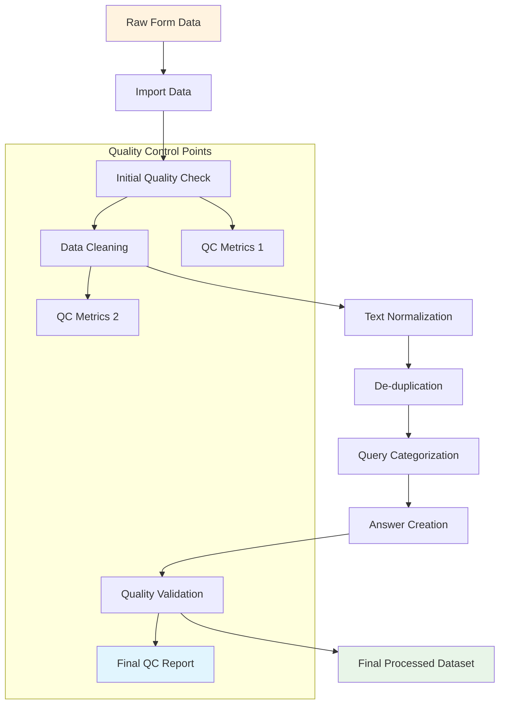

---

## 🧹 Phase 1: Data Import & Initial Quality Check

### Import Procedures

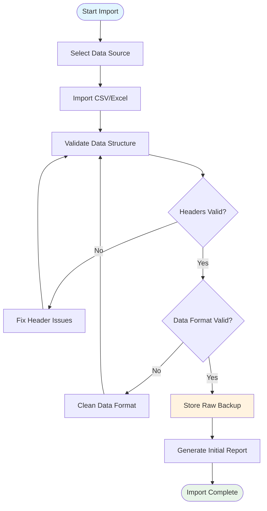

### Quality Metrics to Track

| Metric | Target | Measurement |
|--------|--------|-------------|
| Completeness | ≥95% | % of non-empty required fields |
| Valid Categories | 100% | % of valid category selections |
| Question Length | ≥10 chars | % meeting minimum length |
| Duplicate Rate | ≤5% | % of duplicate entries |
| Invalid Data | ≤2% | % of malformed entries |

### Data Validation Rules

```python
# Validation Rules Pseudocode
validation_rules = {
    "question_text": {
        "min_length": 10,
        "max_length": 1000,
        "required": True,
        "no_profanity": True
    },
    "program_department": {
        "allowed_values": program_list,
        "required": True
    },
    "year_of_study": {
        "allowed_values": ["1st Year", "2nd Year", "3rd Year", "4th Year", "5th Year"],
        "required": True
    },
    "question_category": {
        "allowed_values": category_list,
        "required": True
    }
}
```

---

## 🧼 Phase 2: Data Cleaning & Normalization

### Cleaning Workflow

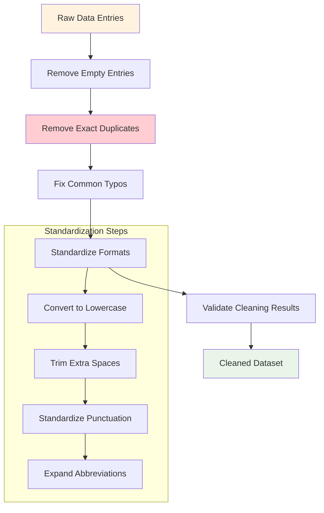

### Text Normalization Pipeline

#### 1. Basic Text Cleaning
- Convert to lowercase
- Remove extra whitespace
- Standardize punctuation
- Remove special characters (except meaningful ones)

#### 2. Common LPU-Specific Normalizations
```python
normalization_dict = {
    # LPU specific terms
    "ums": "UMS",
    "lpu connect": "LPU Connect",
    "id card": "ID card",
    "hostel warden": "hostel warden",
    
    # Academic terms
    "bt": "B.Tech",
    "btech": "B.Tech",
    "mtech": "M.Tech",
    "bca": "BCA",
    "mca": "MCA",
    
    # Common typos
    "admisson": "admission",
    "examn": "exam",
    "fees": "fee",
    "libary": "library"
}
```

#### 3. Advanced Processing
- Spell checking using context-aware algorithms
- Slang and informal language mapping
- Abbreviation expansion
- Contextual phrase standardization

### De-duplication Strategy

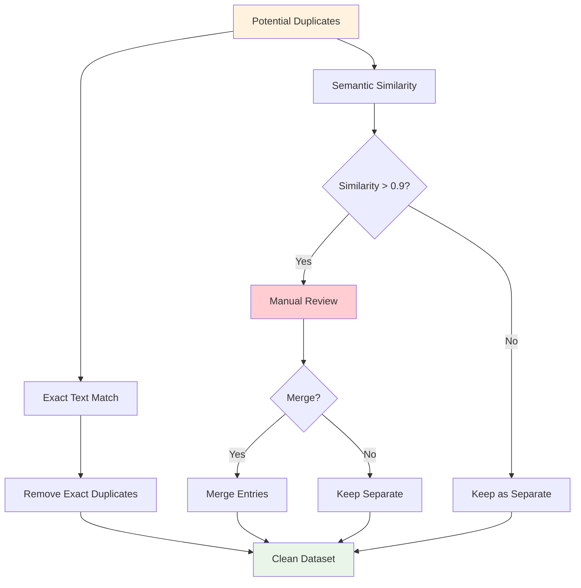

---

## 📂 Phase 3: Query Categorization & Enhancement

### Automated Categorization

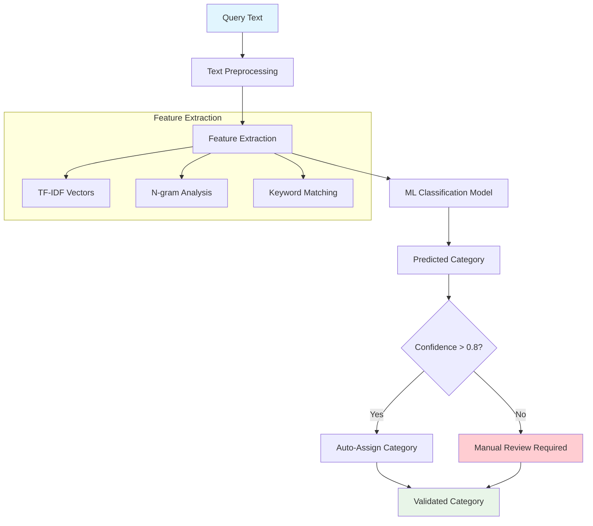

### Category Refinement Process

#### Primary Categories (21 total)
1. **Academics & Courses** - Course-related queries
2. **Admissions & Applications** - Admission procedures
3. **Exams & Results** - Examination processes and results
4. **Fees & Payments** - Financial matters
5. **Hostel & Accommodation** - Hostel-related queries
6. **Transport & Parking** - Transportation queries
7. **Placements & Internships** - Career-related queries
8. **Campus Facilities** - General campus facilities
9. **Library Services** - Library-specific queries
10. **Sports & Recreation** - Sports and recreational activities
11. **Student Clubs & Activities** - Extracurricular activities
12. **Certificates & Documents** - Document requests
13. **IT Services & Support** - Technical support
14. **Health Services** - Medical facilities
15. **Career Guidance** - Career counseling
16. **Scholarships & Financial Aid** - Financial assistance
17. **Exam Schedule** - Examination schedules
18. **Timetable & Classes** - Class schedules
19. **Attendance Requirements** - Attendance policies
20. **Project Work & Thesis** - Academic projects
21. **General Information** - Miscellaneous queries

### Sub-category Creation

For each primary category, create sub-categories for better organization:

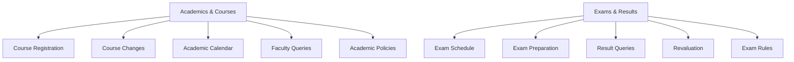

---

## ✍️ Phase 4: Answer Creation & Validation

### Answer Creation Workflow

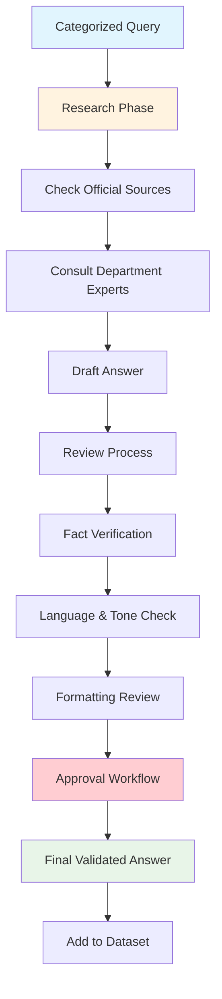

### Answer Quality Standards

#### Content Requirements
- **Accuracy**: 100% factually correct
- **Completeness**: Addresses the full question
- **Clarity**: Easy to understand language
- **Conciseness**: Direct and to the point
- **Actionability**: Provides clear next steps

#### Format Guidelines
- **Length**: 50-200 words typically
- **Structure**: Clear beginning, middle, end
- **Tone**: Helpful, professional, student-friendly
- **Contact Info**: Include relevant contact details when needed

#### Answer Template
```markdown
**Direct Answer**: [Clear, direct response to the question]

**Process Steps**:
1. [Step 1 if applicable]
2. [Step 2 if applicable]
3. [Step 3 if applicable]

**Additional Information**:
- [Relevant details]
- [Contact information]
- [Related resources]

**Important Notes**:
- [Warnings or special considerations]
```

### Quality Validation Checklist

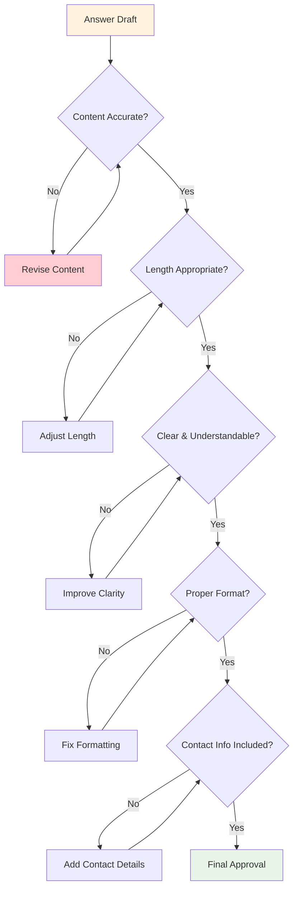

---

## 📊 Phase 5: Final Dataset Assembly

### Dataset Structure

```json
{
  "dataset_info": {
    "version": "1.0",
    "created_date": "2024-01-15",
    "total_entries": 500,
    "categories": 21,
    "last_updated": "2024-01-15"
  },
  "entries": [
    {
      "id": "query_001",
      "original_query": "How to apply for duplicate ID card?",
      "normalized_query": "how to apply for duplicate id card",
      "category": "Certificates & Documents",
      "subcategory": "Student ID",
      "answer": "Visit Block 32, Admin Section with your student ID proof and ₹200 fee. Processing takes 2 working days.",
      "metadata": {
        "department": "All Departments",
        "year": "All Years",
        "frequency": "Often",
        "difficulty": "Easy",
        "confidence_score": 0.95,
        "created_date": "2024-01-10",
        "reviewed_by": "Admin Team",
        "last_updated": "2024-01-12"
      }
    }
  ],
  "statistics": {
    "category_distribution": {
      "Academics & Courses": 85,
      "Exams & Results": 72,
      "Hostel & Accommodation": 63,
      "Certificates & Documents": 58,
      "Fees & Payments": 52,
      "Other Categories": 170
    },
    "quality_metrics": {
      "average_confidence": 0.87,
      "completeness_rate": 0.98,
      "accuracy_estimate": 0.92
    }
  }
}
```

### Quality Assurance Process

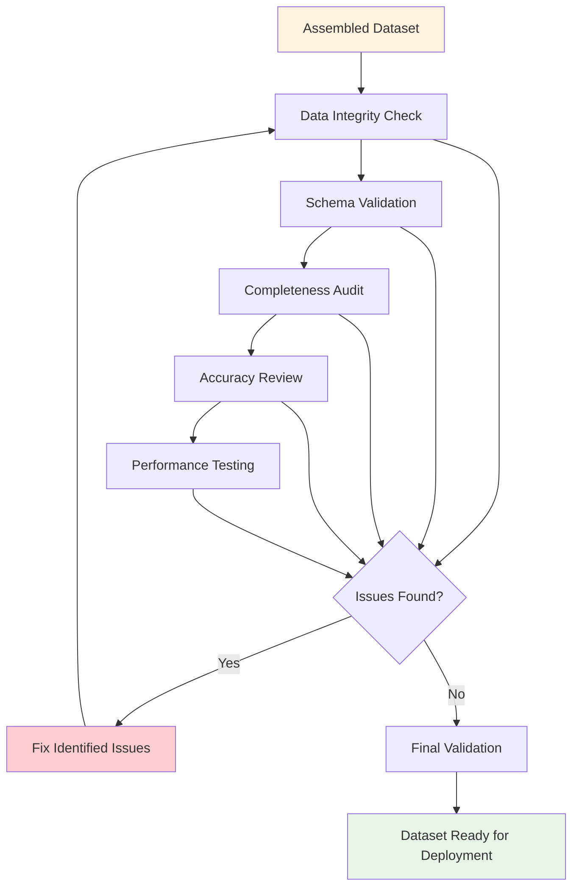

---

## 📈 Processing Metrics & KPIs

### Processing Efficiency Metrics

| Metric | Target | Measurement Frequency |
|--------|--------|----------------------|
| Processing Speed | 1000 queries/hour | Real-time |
| Error Rate | <1% | Per batch |
| Manual Review Rate | <20% | Per batch |
| Quality Score | >0.85 | Per dataset |

### Dataset Quality Metrics

| Metric | Target | Acceptance Criteria |
|--------|--------|-------------------|
| Category Accuracy | >95% | Correct categorization |
| Answer Accuracy | 100% | Factually correct |
| Completeness | >98% | All required fields filled |
| Consistency | >90% | Uniform format and style |

### Continuous Improvement Metrics

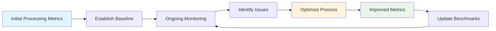

---

## 🛠 Tools & Technologies

### Required Software Stack

#### Data Processing
- **Python 3.8+**: Primary programming language
- **Pandas**: Data manipulation and analysis
- **NumPy**: Numerical computations
- **NLTK/spaCy**: Natural language processing
- **scikit-learn**: Machine learning for categorization
- **fuzzywuzzy**: Fuzzy string matching

#### Quality Assurance
- **pytest**: Unit testing
- **Great Expectations**: Data validation
- **pre-commit**: Code quality checks

#### Data Storage
- **SQLite/PostgreSQL**: Structured data storage
- **JSON**: Dataset export format
- **CSV**: Raw data import/export

### Processing Pipeline Architecture

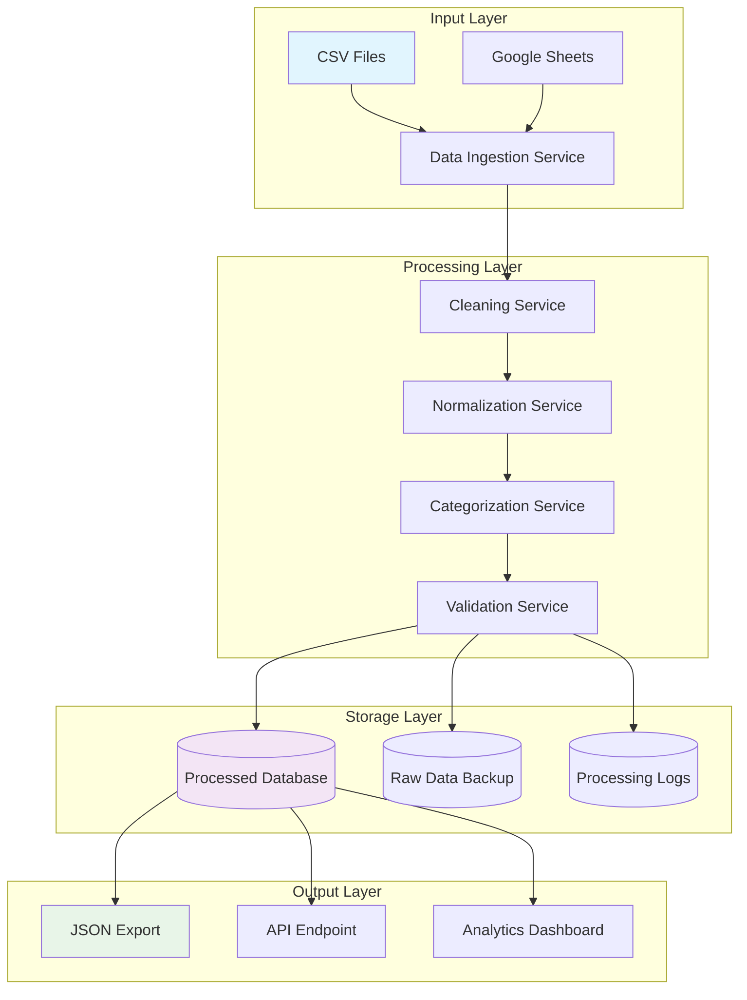

---

## 🔄 Maintenance & Updates

### Ongoing Data Maintenance

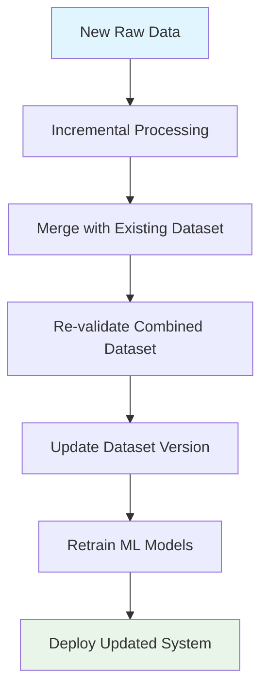

### Version Control Strategy

- **Semantic Versioning**: MAJOR.MINOR.PATCH
- **Backup Strategy**: Keep last 5 versions
- **Rollback Plan**: Ability to revert to previous versions
- **Change Logs**: Detailed documentation of all changes

### Quality Monitoring Dashboard

Track the following metrics in real-time:
- Processing speed and throughput
- Error rates and types
- Quality scores over time
- Category distribution changes
- User feedback on answers

This comprehensive data processing workflow ensures that the LPU Query Chatbot is built on a foundation of high-quality, well-structured data that continuously improves over time.
