# 📅 LPU Query Chatbot - Implementation Timeline & Milestones

## 🎯 Project Overview Timeline

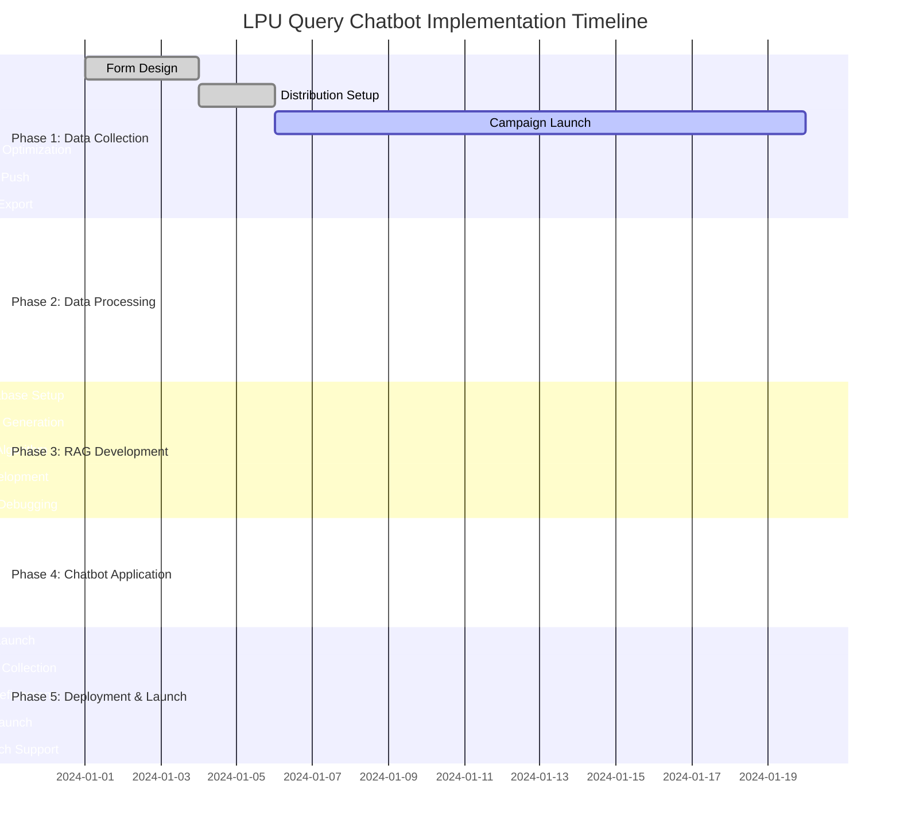
```mermaid
gantt
    title LPU Query Chatbot Implementation Timeline
    dateFormat  YYYY-MM-DD
    section Phase 1: Data Collection
    Form Design           :done, form, 2024-01-01, 3d
    Distribution Setup     :done, dist, after form, 2d
    Campaign Launch        :active, launch, after dist, 14d
    Monitoring & Optimization :monitor, after launch, 14d
    Final Push            :push, after monitor, 3d
    Data Export            :export, after push, 2d
    
    section Phase 2: Data Processing
    Data Import           :import, after export, 2d
    Data Cleaning         :cleaning, after import, 5d
    Normalization         :norm, after cleaning, 3d
    Categorization        :cat, after norm, 4d
    Answer Creation       :answer, after cat, 7d
    Quality Validation    :quality, after answer, 3d
    
    section Phase 3: RAG Development
    Vector Database Setup  :vector, after quality, 4d
    Embedding Generation  :embed, after vector, 3d
    Search Algorithm      :search, after embed, 5d
    API Development       :api, after search, 6d
    Testing & Debugging   :test3, after api, 4d
    
    section Phase 4: Chatbot Application
    Frontend Development  :frontend, after test3, 8d
    Integration          :integration, after frontend, 4d
    User Testing         :utest, after integration, 5d
    Performance Optimization :perf, after utest, 3d
    
    section Phase 5: Deployment & Launch
    Beta Launch          :beta, after perf, 3d
    Feedback Collection   :feedback, after beta, 7d
    System Refinement    :refine, after feedback, 4d
    Full Launch          :launch, after refine, 2d
    Post-Launch Support  :support, after launch, 30d
```

---

## 📋 Detailed Phase Breakdown

### Phase 1: Data Collection (Weeks 1-4)

#### Week 1: Foundation Setup
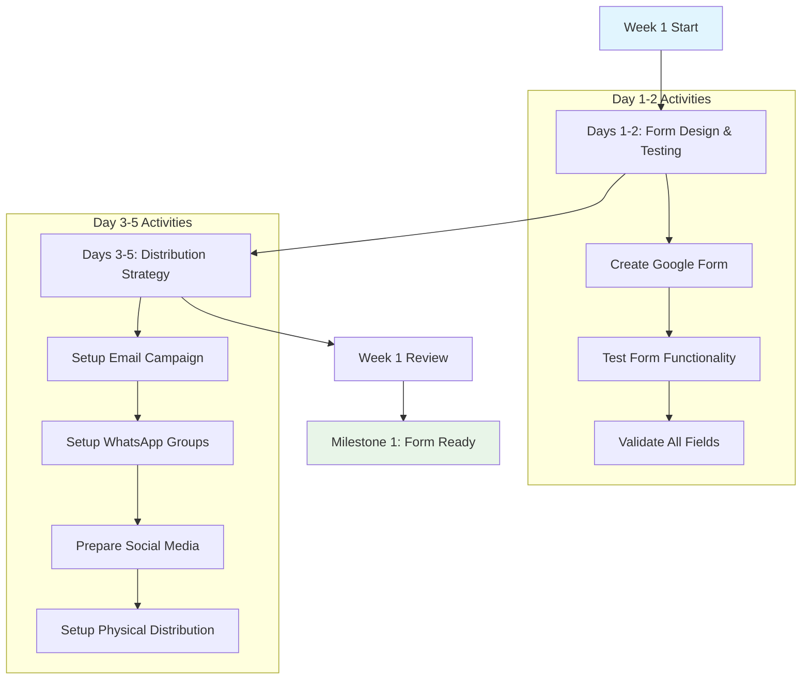
```mermaid
flowchart TD
    Week1Start[Week 1 Start] --> Day1_2[Days 1-2: Form Design & Testing]
    Day1_2 --> Day3_5[Days 3-5: Distribution Strategy]
    Day3_5 --> Week1Review[Week 1 Review]
    
    subgraph "Day 1-2 Activities"
        Day1_2 --> CreateForm[Create Google Form]
        CreateForm --> TestForm[Test Form Functionality]
        TestForm --> ValidateForm[Validate All Fields]
    end
    
    subgraph "Day 3-5 Activities"
        Day3_5 --> EmailSetup[Setup Email Campaign]
        EmailSetup --> WhatsAppSetup[Setup WhatsApp Groups]
        WhatsAppSetup --> SocialMediaPrep[Prepare Social Media]
        SocialMediaPrep --> PhysicalSetup[Setup Physical Distribution]
    end
    
    Week1Review --> Milestone1[Milestone 1: Form Ready]
    
    style Week1Start fill:#e1f5fe
    style Milestone1 fill:#e8f5e8
```

#### Week 2-3: Campaign Execution
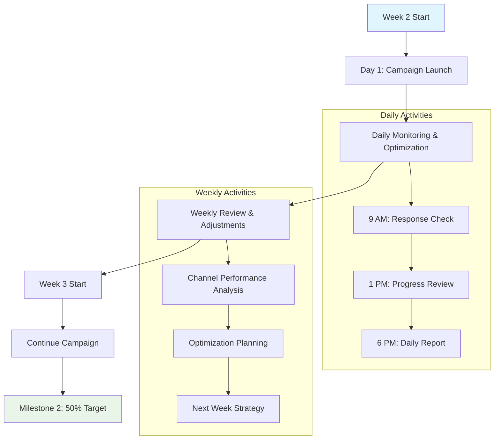
```mermaid
flowchart TD
    Week2Start[Week 2 Start] --> LaunchDay[Day 1: Campaign Launch]
    LaunchDay --> DailyMonitoring[Daily Monitoring & Optimization]
    DailyMonitoring --> WeeklyReview[Weekly Review & Adjustments]
    WeeklyReview --> Week3Start[Week 3 Start]
    
    subgraph "Daily Activities"
        DailyMonitoring --> MorningCheck[9 AM: Response Check]
        MorningCheck --> AfternoonCheck[1 PM: Progress Review]
        AfternoonCheck --> EveningCheck[6 PM: Daily Report]
    end
    
    subgraph "Weekly Activities"
        WeeklyReview --> PerformanceAnalysis[Channel Performance Analysis]
        PerformanceAnalysis --> OptimizationPlan[Optimization Planning]
        OptimizationPlan --> NextWeekPlan[Next Week Strategy]
    end
    
    Week3Start --> ContinueCampaign[Continue Campaign]
    ContinueCampaign --> Milestone2[Milestone 2: 50% Target]
    
    style Week2Start fill:#e1f5fe
    style Milestone2 fill:#e8f5e8
```

#### Week 4: Final Push & Export
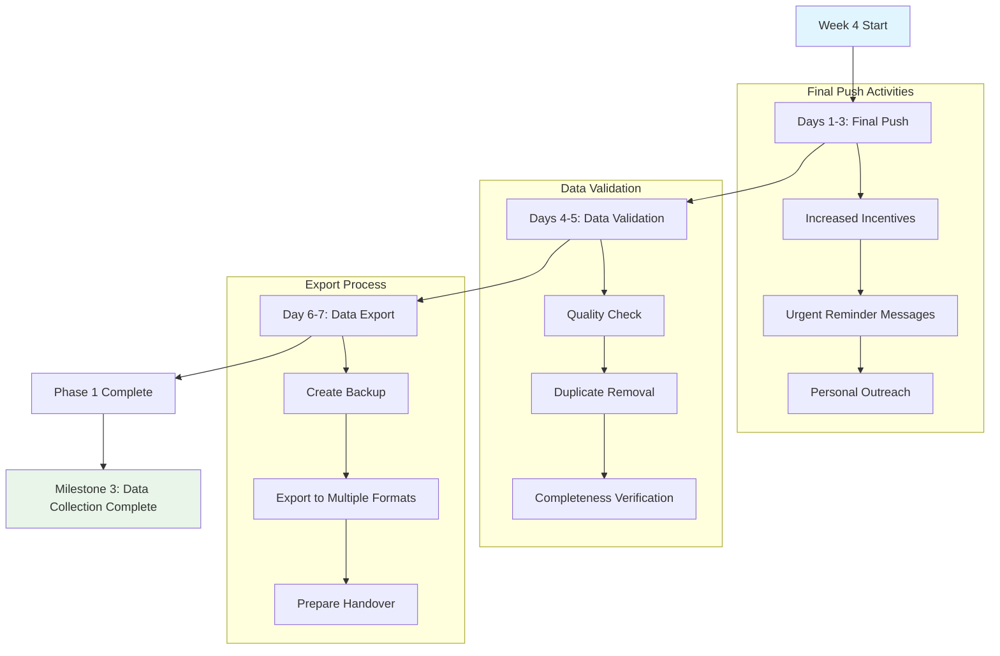
```mermaid
flowchart TD
    Week4Start[Week 4 Start] --> FinalPush[Days 1-3: Final Push]
    FinalPush --> DataValidation[Days 4-5: Data Validation]
    DataValidation --> ExportPhase[Day 6-7: Data Export]
    ExportPhase --> Phase1Complete[Phase 1 Complete]
    
    subgraph "Final Push Activities"
        FinalPush --> IncreasedIncentives[Increased Incentives]
        IncreasedIncentives --> UrgentMessages[Urgent Reminder Messages]
        UrgentMessages --> PersonalOutreach[Personal Outreach]
    end
    
    subgraph "Data Validation"
        DataValidation --> QualityCheck[Quality Check]
        QualityCheck --> DuplicateRemoval[Duplicate Removal]
        DuplicateRemoval --> CompletenessCheck[Completeness Verification]
    end
    
    subgraph "Export Process"
        ExportPhase --> BackupCreation[Create Backup]
        BackupCreation --> MultipleFormats[Export to Multiple Formats]
        MultipleFormats --> HandoverPrep[Prepare Handover]
    end
    
    Phase1Complete --> Milestone3[Milestone 3: Data Collection Complete]
    
    style Week4Start fill:#e1f5fe
    style Milestone3 fill:#e8f5e8
```

---

### Phase 2: Data Processing (Weeks 5-7)

#### Week 5: Data Import & Cleaning
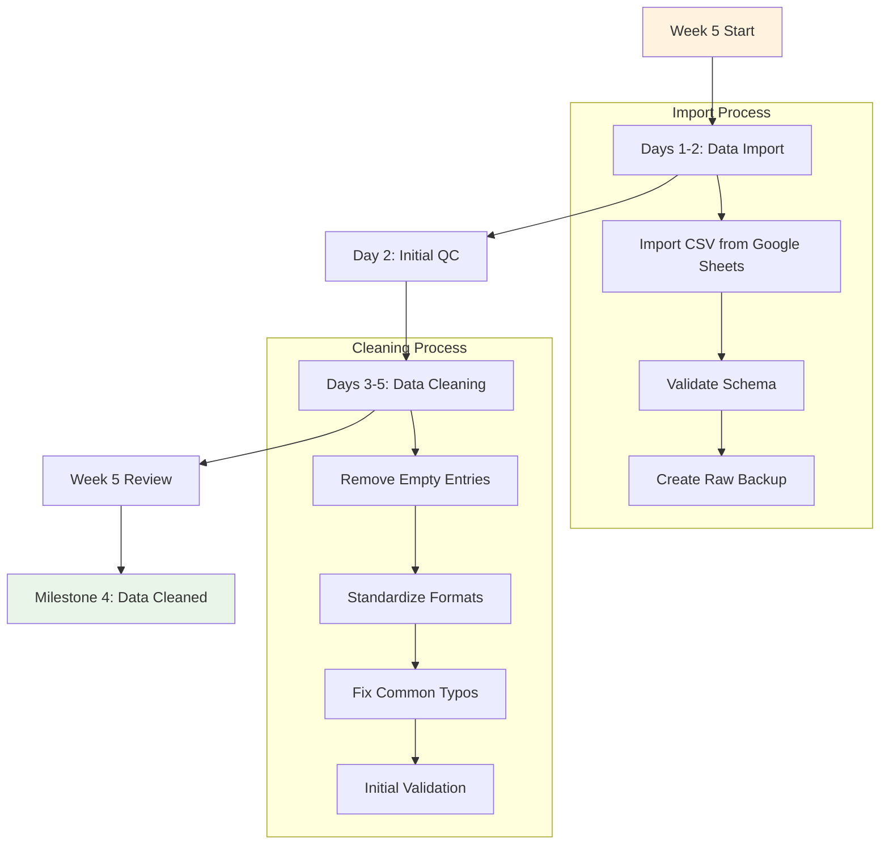
```mermaid
flowchart TD
    Week5Start[Week 5 Start] --> DataImport[Days 1-2: Data Import]
    DataImport --> InitialQC[Day 2: Initial QC]
    InitialQC --> DataCleaning[Days 3-5: Data Cleaning]
    DataCleaning --> Week5Review[Week 5 Review]
    
    subgraph "Import Process"
        DataImport --> CSVImport[Import CSV from Google Sheets]
        CSVImport --> SchemaValidation[Validate Schema]
        SchemaValidation --> RawBackup[Create Raw Backup]
    end
    
    subgraph "Cleaning Process"
        DataCleaning --> RemoveEmpty[Remove Empty Entries]
        RemoveEmpty --> StandardizeFormat[Standardize Formats]
        StandardizeFormat --> FixTypos[Fix Common Typos]
        FixTypos --> InitialValidation[Initial Validation]
    end
    
    Week5Review --> Milestone4[Milestone 4: Data Cleaned]
    
    style Week5Start fill:#fff3e0
    style Milestone4 fill:#e8f5e8
```

#### Week 6: Normalization & Categorization
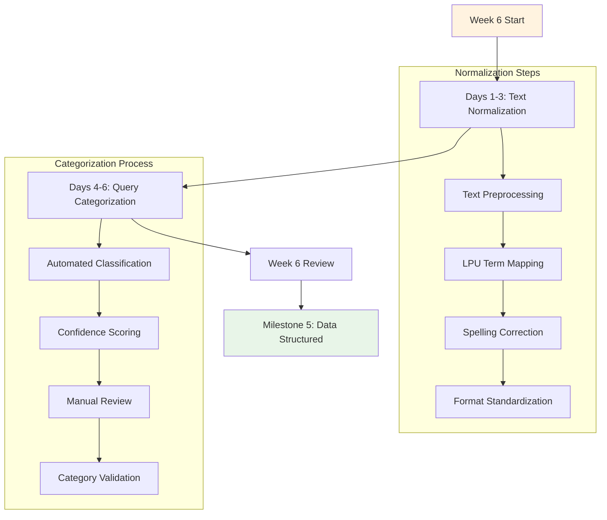
```mermaid
flowchart TD
    Week6Start[Week 6 Start] --> Normalization[Days 1-3: Text Normalization]
    Normalization --> Categorization[Days 4-6: Query Categorization]
    Categorization --> Week6Review[Week 6 Review]
    
    subgraph "Normalization Steps"
        Normalization --> TextPreprocessing[Text Preprocessing]
        TextPreprocessing --> LPUTermMapping[LPU Term Mapping]
        LPUTermMapping --> SpellingCorrection[Spelling Correction]
        SpellingCorrection --> FormatStandardization[Format Standardization]
    end
    
    subgraph "Categorization Process"
        Categorization --> AutomatedClassification[Automated Classification]
        AutomatedClassification --> ConfidenceScoring[Confidence Scoring]
        ConfidenceScoring --> ManualReview[Manual Review]
        ManualReview --> CategoryValidation[Category Validation]
    end
    
    Week6Review --> Milestone5[Milestone 5: Data Structured]
    
    style Week6Start fill:#fff3e0
    style Milestone5 fill:#e8f5e8
```

#### Week 7: Answer Creation & Validation
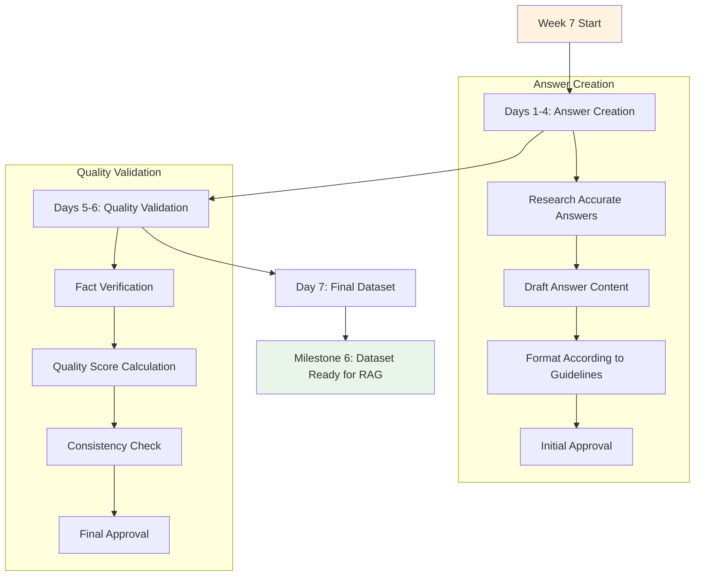
```mermaid
flowchart TD
    Week7Start[Week 7 Start] --> AnswerCreation[Days 1-4: Answer Creation]
    AnswerCreation --> QualityValidation[Days 5-6: Quality Validation]
    QualityValidation --> FinalDataset[Day 7: Final Dataset]
    
    subgraph "Answer Creation"
        AnswerCreation --> ResearchAnswers[Research Accurate Answers]
        ResearchAnswers --> DraftAnswers[Draft Answer Content]
        DraftAnswers --> FormatAnswers[Format According to Guidelines]
        FormatAnswers --> InitialApproval[Initial Approval]
    end
    
    subgraph "Quality Validation"
        QualityValidation --> FactVerification[Fact Verification]
        FactVerification --> QualityCheck[Quality Score Calculation]
        QualityCheck --> ConsistencyCheck[Consistency Check]
        ConsistencyCheck --> FinalApproval[Final Approval]
    end
    
    FinalDataset --> Milestone6[Milestone 6: Dataset Ready for RAG]
    
    style Week7Start fill:#fff3e0
    style Milestone6 fill:#e8f5e8
```

---

### Phase 3: RAG Development (Weeks 8-11)

#### Week 8: Vector Database Setup
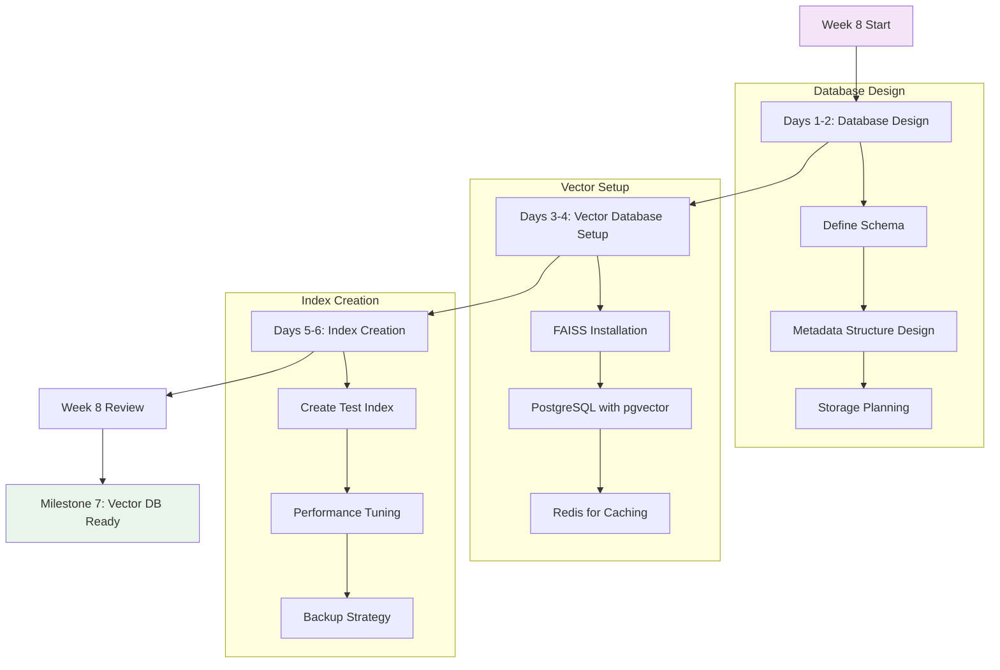
```mermaid
flowchart TD
    Week8Start[Week 8 Start] --> DatabaseDesign[Days 1-2: Database Design]
    DatabaseDesign --> VectorSetup[Days 3-4: Vector Database Setup]
    VectorSetup --> IndexCreation[Days 5-6: Index Creation]
    IndexCreation --> Week8Review[Week 8 Review]
    
    subgraph "Database Design"
        DatabaseDesign --> SchemaDefinition[Define Schema]
        SchemaDefinition --> MetadataStructure[Metadata Structure Design]
        MetadataStructure --> StoragePlanning[Storage Planning]
    end
    
    subgraph "Vector Setup"
        VectorSetup --> FAISSSetup[FAISS Installation]
        FAISSSetup --> PostgreSQLSetup[PostgreSQL with pgvector]
        PostgreSQLSetup --> RedisSetup[Redis for Caching]
    end
    
    subgraph "Index Creation"
        IndexCreation --> TestIndex[Create Test Index]
        TestIndex --> PerformanceTuning[Performance Tuning]
        PerformanceTuning --> BackupStrategy[Backup Strategy]
    end
    
    Week8Review --> Milestone7[Milestone 7: Vector DB Ready]
    
    style Week8Start fill:#f3e5f5
    style Milestone7 fill:#e8f5e8
```

#### Week 9: Embedding Generation
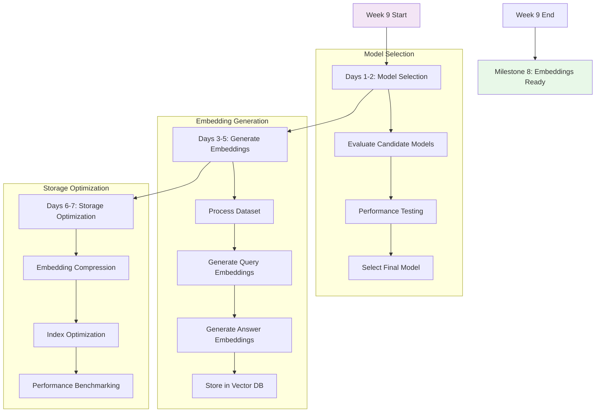
```mermaid
flowchart TD
    Week9Start[Week 9 Start] --> ModelSelection[Days 1-2: Model Selection]
    ModelSelection --> EmbeddingGeneration[Days 3-5: Generate Embeddings]
    EmbeddingGeneration --> StorageOptimization[Days 6-7: Storage Optimization]
    
    subgraph "Model Selection"
        ModelSelection --> EvaluateModels[Evaluate Candidate Models]
        EvaluateModels --> PerformanceTesting[Performance Testing]
        PerformanceTesting --> FinalModelSelection[Select Final Model]
    end
    
    subgraph "Embedding Generation"
        EmbeddingGeneration --> ProcessDataset[Process Dataset]
        ProcessDataset --> GenerateQueryEmbeddings[Generate Query Embeddings]
        GenerateQueryEmbeddings --> GenerateAnswerEmbeddings[Generate Answer Embeddings]
        GenerateAnswerEmbeddings --> StoreEmbeddings[Store in Vector DB]
    end
    
    subgraph "Storage Optimization"
        StorageOptimization --> Compression[Embedding Compression]
        Compression --> IndexOptimization[Index Optimization]
        IndexOptimization --> PerformanceBenchmarking[Performance Benchmarking]
    end
    
    Week9End[Week 9 End] --> Milestone8[Milestone 8: Embeddings Ready]
    
    style Week9Start fill:#f3e5f5
    style Milestone8 fill:#e8f8e8
```

#### Week 10: Search Algorithm Development
```mermaid
flowchart TD
    Week10Start[Week 10 Start] --> AlgorithmDesign[Days 1-2: Search Algorithm Design]
    AlgorithmDesign --> Implementation[Days 3-5: Implementation]
    Implementation --> Testing[Days 6-7: Testing & Refinement]
    
    subgraph "Algorithm Design"
        AlgorithmDesign --> HybridSearch[Hybrid Search Strategy]
        HybridSearch --> ScoringMechanism[Scoring Mechanism]
        ScoringMechanism --> OptimizationStrategy[Optimization Strategy]
    end
    
    subgraph "Implementation"
        Implementation --> VectorSearch[Vector Similarity Search]
        VectorSearch --> KeywordSearch[Keyword Search Integration]
        KeywordSearch --> CategoryFilter[Category Filtering]
        CategoryFilter --> RankingAlgorithm[Ranking Algorithm]
    end
    
    subgraph "Testing & Refinement"
        Testing --> UnitTesting[Unit Testing]
        UnitTesting --> IntegrationTesting[Integration Testing]
        IntegrationTesting --> PerformanceTesting[Performance Testing]
        PerformanceTesting --> AlgorithmRefinement[Algorithm Refinement]
    end
    
    Week10End[Week 10 End] --> Milestone9[Milestone 9: Search System Ready]
    
    style Week10Start fill:#f3e5f5
    style Milestone9 fill:#e8f8e8
```

#### Week 11: API Development & Testing
```mermaid
flowchart TD
    Week11Start[Week 11 Start] --> APIDesign[Days 1-2: API Design]
    APIDesign --> Implementation[Days 3-5: API Implementation]
    Implementation --> Integration[Days 6-7: Integration Testing]
    
    subgraph "API Design"
        APIDesign --> EndpointDefinition[Define Endpoints]
        EndpointDefinition --> RequestSchema[Request/Response Schema]
        RequestSchema --> ErrorHandling[Error Handling Strategy]
    end
    
    subgraph "Implementation"
        Implementation --> QueryEndpoint[Query Processing Endpoint]
        QueryEndpoint --> FeedbackEndpoint[Feedback Collection Endpoint]
        FeedbackEndpoint --> AdminEndpoint[Admin Management Endpoint]
    end
    
    subgraph "Integration Testing"
        Integration --> EndToEndTesting[End-to-End Testing]
        EndToEndTesting --> LoadTesting[Load Testing]
        LoadTesting --> SecurityTesting[Security Testing]
    end
    
    Week11End[Week 11 End] --> Milestone10[Milestone 10: RAG System Complete]
    
    style Week11Start fill:#f3e5f5
    style Milestone10 fill:#e8f8e8
```

---

### Phase 4: Chatbot Application (Weeks 12-15)

#### Week 12-13: Frontend Development
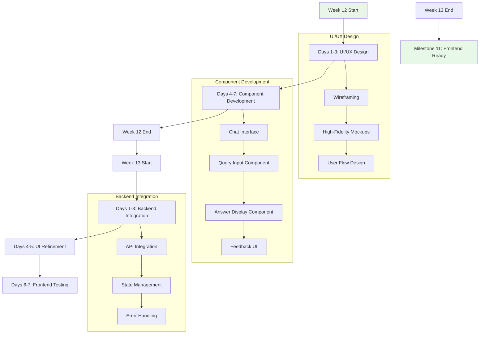
```mermaid
flowchart TD
    Week12Start[Week 12 Start] --> UI_Design[Days 1-3: UI/UX Design]
    UI_Design --> ComponentDevelopment[Days 4-7: Component Development]
    ComponentDevelopment --> Week12End[Week 12 End]
    
    Week12End --> Week13Start[Week 13 Start]
    Week13Start --> Integration[Days 1-3: Backend Integration]
    Integration --> UI_Refinement[Days 4-5: UI Refinement]
    UI_Refinement --> Testing[Days 6-7: Frontend Testing]
    
    subgraph "UI/UX Design"
        UI_Design --> Wireframing[Wireframing]
        Wireframing --> Mockups[High-Fidelity Mockups]
        Mockups --> UserFlowDesign[User Flow Design]
    end
    
    subgraph "Component Development"
        ComponentDevelopment --> ChatInterface[Chat Interface]
        ChatInterface --> QueryInput[Query Input Component]
        QueryInput --> AnswerDisplay[Answer Display Component]
        AnswerDisplay --> FeedbackUI[Feedback UI]
    end
    
    subgraph "Backend Integration"
        Integration --> API_Integration[API Integration]
        API_Integration --> StateManagement[State Management]
        StateManagement --> ErrorHandling[Error Handling]
    end
    
    Week13End[Week 13 End] --> Milestone11[Milestone 11: Frontend Ready]
    
    style Week12Start fill:#e8f5e8
    style Milestone11 fill:#e8f8e8
```

#### Week 14: System Integration
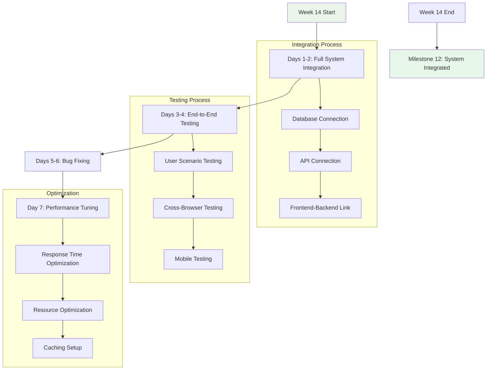
```mermaid
flowchart TD
    Week14Start[Week 14 Start] --> FullIntegration[Days 1-2: Full System Integration]
    FullIntegration --> EndToEndTesting[Days 3-4: End-to-End Testing]
    EndToEndTesting --> BugFixing[Days 5-6: Bug Fixing]
    BugFixing --> PerformanceTuning[Day 7: Performance Tuning]
    
    subgraph "Integration Process"
        FullIntegration --> DatabaseConnection[Database Connection]
        DatabaseConnection --> API_Connection[API Connection]
        API_Connection --> FrontendBackendLink[Frontend-Backend Link]
    end
    
    subgraph "Testing Process"
        EndToEndTesting --> UserScenarioTesting[User Scenario Testing]
        UserScenarioTesting --> CrossBrowserTesting[Cross-Browser Testing]
        CrossBrowserTesting --> MobileTesting[Mobile Testing]
    end
    
    subgraph "Optimization"
        PerformanceTuning --> ResponseTimeOptimization[Response Time Optimization]
        ResponseTimeOptimization --> ResourceOptimization[Resource Optimization]
        ResourceOptimization --> CachingSetup[Caching Setup]
    end
    
    Week14End[Week 14 End] --> Milestone12[Milestone 12: System Integrated]
    
    style Week14Start fill:#e8f5e8
    style Milestone12 fill:#e8f8e8
```

#### Week 15: User Testing & Optimization
```mermaid
flowchart TD
    Week15Start[Week 15 Start] --> BetaTesting[Days 1-3: Beta Testing]
    BetaTesting --> UserFeedback[Days 4-5: User Feedback Collection]
    UserFeedback --> Optimization[Days 6-7: Optimization]
    
    subgraph "Beta Testing"
        BetaTesting --> UserRecruitment[User Recruitment]
        UserRecruitment --> TestingSessions[Testing Sessions]
        TestingSessions --> FeedbackCollection[Feedback Collection]
    end
    
    subgraph "Feedback Analysis"
        UserFeedback --> FeedbackAnalysis[Feedback Analysis]
        FeedbackAnalysis --> IssueIdentification[Issue Identification]
        IssueIdentification --> Prioritization[Prioritization of Issues]
    end
    
    subgraph "Optimization"
        Optimization --> UI_Refinement[UI Refinements]
        UI_Refinement --> PerformanceImprovements[Performance Improvements]
        PerformanceImprovements --> BugFixes[Critical Bug Fixes]
    end
    
    Week15End[Week 15 End] --> Milestone13[Milestone 13: Application Ready for Launch]
    
    style Week15Start fill:#e8f5e8
    style Milestone13 fill:#e8f8e8
```

---

### Phase 5: Deployment & Launch (Weeks 16-17)

#### Week 16: Beta Launch
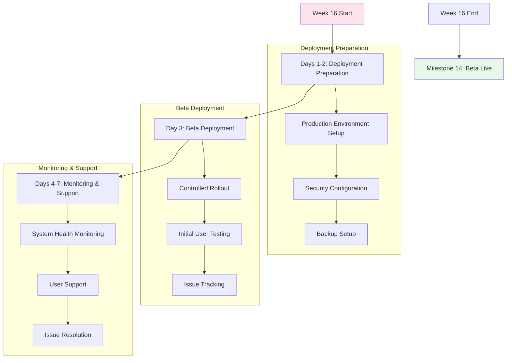
```mermaid
flowchart TD
    Week16Start[Week 16 Start] --> DeploymentPreparation[Days 1-2: Deployment Preparation]
    DeploymentPreparation --> BetaDeployment[Day 3: Beta Deployment]
    BetaDeployment --> Monitoring[Days 4-7: Monitoring & Support]
    
    subgraph "Deployment Preparation"
        DeploymentPreparation --> ProductionSetup[Production Environment Setup]
        ProductionSetup --> SecurityConfiguration[Security Configuration]
        SecurityConfiguration --> BackupSetup[Backup Setup]
    end
    
    subgraph "Beta Deployment"
        BetaDeployment --> ControlledRollout[Controlled Rollout]
        ControlledRollout --> InitialUserTesting[Initial User Testing]
        InitialUserTesting --> IssueTracking[Issue Tracking]
    end
    
    subgraph "Monitoring & Support"
        Monitoring --> SystemMonitoring[System Health Monitoring]
        SystemMonitoring --> UserSupport[User Support]
        UserSupport --> IssueResolution[Issue Resolution]
    end
    
    Week16End[Week 16 End] --> Milestone14[Milestone 14: Beta Live]
    
    style Week16Start fill:#fce4ec
    style Milestone14 fill:#e8f8e8
```

#### Week 17: Full Launch
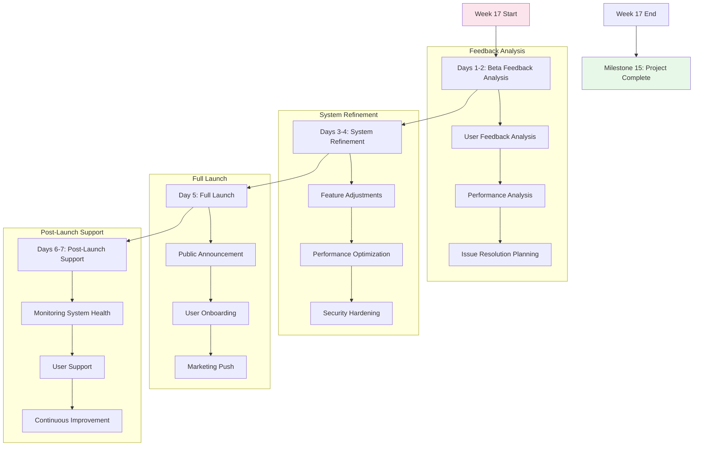
```mermaid
flowchart TD
    Week17Start[Week 17 Start] --> FeedbackAnalysis[Days 1-2: Beta Feedback Analysis]
    FeedbackAnalysis --> SystemRefinement[Days 3-4: System Refinement]
    SystemRefinement --> FullLaunch[Day 5: Full Launch]
    FullLaunch --> PostLaunchSupport[Days 6-7: Post-Launch Support]
    
    subgraph "Feedback Analysis"
        FeedbackAnalysis --> UserFeedbackAnalysis[User Feedback Analysis]
        UserFeedbackAnalysis --> PerformanceAnalysis[Performance Analysis]
        PerformanceAnalysis --> IssueResolution[Issue Resolution Planning]
    end
    
    subgraph "System Refinement"
        SystemRefinement --> FeatureAdjustments[Feature Adjustments]
        FeatureAdjustments --> PerformanceOptimization[Performance Optimization]
        PerformanceOptimization --> SecurityHardening[Security Hardening]
    end
    
    subgraph "Full Launch"
        FullLaunch --> PublicAnnouncement[Public Announcement]
        PublicAnnouncement --> UserOnboarding[User Onboarding]
        UserOnboarding --> MarketingPush[Marketing Push]
    end
    
    subgraph "Post-Launch Support"
        PostLaunchSupport --> MonitoringSystem[Monitoring System Health]
        MonitoringSystem --> UserSupport[User Support]
        UserSupport --> ContinuousImprovement[Continuous Improvement]
    end
    
    Week17End[Week 17 End] --> Milestone15[Milestone 15: Project Complete]
    
    style Week17Start fill:#fce4ec
    style Milestone15 fill:#e8f8e8
```

---

## 🎯 Critical Milestones & Success Criteria

### Major Milestones

| Milestone | Week | Success Criteria | Deliverables |
|-----------|-------|-----------------|--------------|
| M1: Form Ready | Week 1 | Form tested and validated | Working Google Form |
| M2: 50% Target | Week 2-3 | 100+ responses collected | Progress report |
| M3: Data Collection Complete | Week 4 | 200+ valid responses | Cleaned dataset |
| M4: Data Cleaned | Week 5 | 95% data quality | Cleaned dataset |
| M5: Data Structured | Week 6 | All queries categorized | Structured dataset |
| M6: Dataset Ready | Week 7 | Answers validated | Complete dataset |
| M7: Vector DB Ready | Week 8 | Database operational | Vector database |
| M8: Embeddings Ready | Week 9 | All data embedded | Embedding store |
| M9: Search System Ready | Week 10 | Search API functional | Search service |
| M10: RAG System Complete | Week 11 | End-to-end RAG working | RAG API |
| M11: Frontend Ready | Week 13 | UI fully functional | Web application |
| M12: System Integrated | Week 14 | All components working | Integrated system |
| M13: Application Ready | Week 15 | User tested and optimized | Beta-ready app |
| M14: Beta Live | Week 16 | Beta deployment complete | Live beta system |
| M15: Project Complete | Week 17 | Full launch successful | Production system |

---

## ⚠️ Risk Timeline & Mitigation

### Timeline Risks & Mitigation Strategies

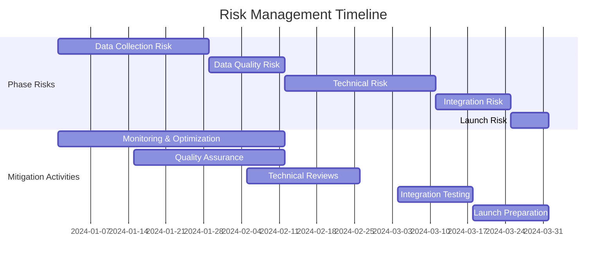
```mermaid
gantt
    title Risk Management Timeline
    dateFormat  YYYY-MM-DD
    section Phase Risks
    Data Collection Risk   :risk1, 2024-01-01, 28d
    Data Quality Risk      :risk2, 2024-01-29, 14d
    Technical Risk         :risk3, 2024-02-12, 28d
    Integration Risk       :risk4, 2024-03-11, 14d
    Launch Risk           :risk5, 2024-03-25, 7d
    
    section Mitigation Activities
    Monitoring & Optimization :mit1, 2024-01-01, 42d
    Quality Assurance     :mit2, 2024-01-15, 28d
    Technical Reviews     :mit3, 2024-02-05, 21d
    Integration Testing   :mit4, 2024-03-04, 14d
    Launch Preparation   :mit5, 2024-03-18, 14d
```

### Risk Monitoring Schedule

| Week | Risk Focus | Monitoring Activities | Mitigation Actions |
|-------|------------|---------------------|-------------------|
| 1-4 | Data Collection | Daily response tracking | Incentive adjustments |
| 5-7 | Data Quality | Validation checks | Manual review processes |
| 8-11 | Technical | Code reviews, testing | Backup implementations |
| 12-15 | Integration | Integration testing | Rollback plans |
| 16-17 | Launch | System monitoring | Rapid response teams |

---

## 📊 Resource Allocation Timeline

### Team Resource Planning

```mermaid
graph TB
    subgraph "Phase 1: Data Collection"
        P1Team[Team: 4-5 people] --> Roles1[Project Lead, Content Specialist, 2x Marketing, Technical Support]
        P1Duration[Duration: 4 weeks] --> P1Effort[Effort: ~80 person-days]
    end
    
    subgraph "Phase 2: Data Processing"
        P2Team[Team: 3-4 people] --> Roles2[Project Lead, Data Analyst, Content Specialist, Technical Support]
        P2Duration[Duration: 3 weeks] --> P2Effort[Effort: ~60 person-days]
    end
    
    subgraph "Phase 3: RAG Development"
        P3Team[Team: 4-5 people] --> Roles3[Technical Lead, 2x Developers, Data Scientist, DevOps]
        P3Duration[Duration: 4 weeks] --> P3Effort[Effort: ~100 person-days]
    end
    
    subgraph "Phase 4: Chatbot Application"
        P4Team[Team: 5-6 people] --> Roles4[Technical Lead, 2x Frontend Dev, Backend Dev, UI/UX Designer, QA]
        P4Duration[Duration: 4 weeks] --> P4Effort[Effort: ~120 person-days]
    end
    
    subgraph "Phase 5: Deployment"
        P5Team[Team: 3-4 people] --> Roles5[DevOps, Technical Lead, Support Specialist, QA]
        P5Duration[Duration: 2 weeks] --> P5Effort[Effort: ~40 person-days]
    end
    
    style P1Team fill:#e1f5fe
    style P2Team fill:#fff3e0
    style P3Team fill:#f3e5f5
    style P4Team fill:#e8f5e8
    style P5Team fill:#fce4ec
```

### Budget Allocation Timeline

| Phase | Duration | Primary Costs | Budget Range |
|--------|-----------|----------------|---------------|
| Data Collection | 4 weeks | Incentives, Marketing, Tools | $2,000-3,000 |
| Data Processing | 3 weeks | Personnel, Software, Storage | $3,000-4,000 |
| RAG Development | 4 weeks | Development, Infrastructure, Models | $5,000-7,000 |
| Chatbot Application | 4 weeks | Development, Design, Testing | $4,000-6,000 |
| Deployment | 2 weeks | Infrastructure, Security, Support | $2,000-3,000 |
| **Total** | **17 weeks** | **All Phases** | **$16,000-23,000** |

---

## 🔄 Continuous Improvement Timeline

### Post-Launch Development Roadmap

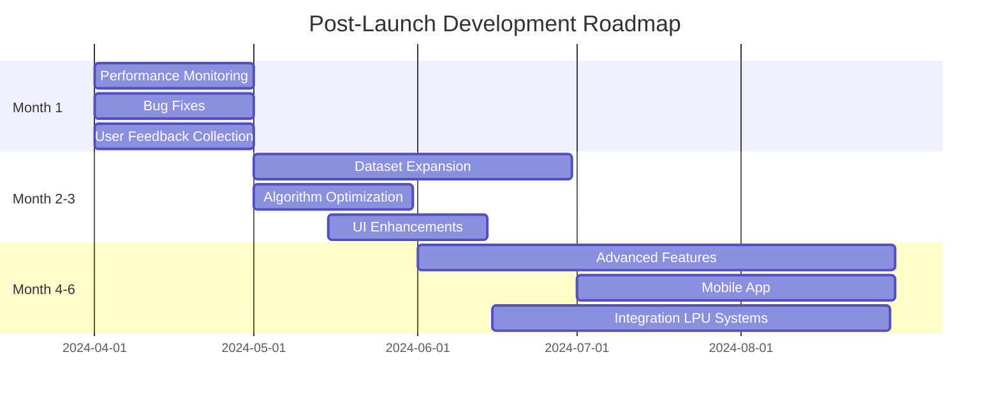
```mermaid
gantt
    title Post-Launch Development Roadmap
    dateFormat  YYYY-MM-DD
    section Month 1
    Performance Monitoring :monitor, 2024-04-01, 30d
    Bug Fixes :fixes, 2024-04-01, 30d
    User Feedback Collection :feedback, 2024-04-01, 30d
    
    section Month 2-3
    Dataset Expansion :dataset, 2024-05-01, 60d
    Algorithm Optimization :algo, 2024-05-01, 30d
    UI Enhancements :ui, 2024-05-15, 30d
    
    section Month 4-6
    Advanced Features :advanced, 2024-06-01, 90d
    Mobile App :mobile, 2024-07-01, 60d
    Integration LPU Systems :integration, 2024-06-15, 75d
```

### Long-term Evolution Plan

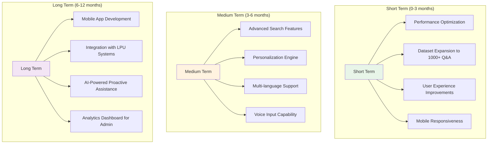
```mermaid
graph TB
    subgraph "Short Term (0-3 months)"
        ST[Short Term] --> ST1[Performance Optimization]
        ST --> ST2[Dataset Expansion to 1000+ Q&A]
        ST --> ST3[User Experience Improvements]
        ST --> ST4[Mobile Responsiveness]
    end
    
    subgraph "Medium Term (3-6 months)"
        MT[Medium Term] --> MT1[Advanced Search Features]
        MT --> MT2[Personalization Engine]
        MT --> MT3[Multi-language Support]
        MT --> MT4[Voice Input Capability]
    end
    
    subgraph "Long Term (6-12 months)"
        LT[Long Term] --> LT1[Mobile App Development]
        LT --> LT2[Integration with LPU Systems]
        LT --> LT3[AI-Powered Proactive Assistance]
        LT --> LT4[Analytics Dashboard for Admin]
    end
    
    style ST fill:#e8f5e8
    style MT fill:#fff3e0
    style LT fill:#f3e5f5
```

---

## 📈 Success Metrics Timeline

### Key Performance Indicators by Phase

```mermaid
graph LR
    subgraph "Phase 1 KPIs"
        P1KPI[Phase 1] --> P1_1[200+ Responses]
        P1KPI --> P1_2[100% Dept Coverage]
        P1KPI --> P1_3[>85% Quality Score]
    end
    
    subgraph "Phase 2 KPIs"
        P2KPI[Phase 2] --> P2_1[95% Data Quality]
        P2KPI --> P2_2[100% Categorization]
        P2KPI --> P2_3[Validated Answers]
    end
    
    subgraph "Phase 3 KPIs"
        P3KPI[Phase 3] --> P3_1[<2s Response Time]
        P3KPI --> P3_2[>85% Retrieval Accuracy]
        P3KPI --> P3_3[99.9% Uptime]
    end
    
    subgraph "Phase 4 KPIs"
        P4KPI[Phase 4] --> P4_1[Intuitive UI]
        P4KPI --> P4_2[Mobile Friendly]
        P4KPI --> P4_3[<5s Page Load]
    end
    
    subgraph "Phase 5 KPIs"
        P5KPI[Phase 5] --> P5_1[Successful Launch]
        P5KPI --> P5_2[>1000 Daily Users]
        P5KPI --> P5_3[>80% Satisfaction]
    end
    
    style P1KPI fill:#e1f5fe
    style P2KPI fill:#fff3e0
    style P3KPI fill:#f3e5f5
    style P4KPI fill:#e8f5e8
    style P5KPI fill:#fce4ec
```

### Monitoring Dashboard Evolution

| Phase | Metrics Focus | Dashboard Features |
|--------|---------------|-------------------|
| Data Collection | Response rates, channel performance | Basic charts, progress tracking |
| Data Processing | Quality scores, processing speed | Quality metrics, validation status |
| RAG Development | Search performance, accuracy | Performance graphs, testing results |
| Chatbot Application | User engagement, UI performance | User analytics, session tracking |
| Deployment | System health, user satisfaction | Real-time monitoring, alert system |

---

## 🎯 Timeline Optimization Strategies

### Acceleration Opportunities

1. **Parallel Processing**: Overlap data processing with initial RAG development
2. **Pre-built Components**: Use existing libraries and frameworks
3. **Incremental Development**: Start with MVP, add features iteratively
4. **Resource Scaling**: Increase team size during critical phases

### Timeline Buffers

- **Data Collection**: +1 week buffer for collection challenges
- **Technical Development**: +3 days buffer per phase for debugging
- **Integration**: +1 week buffer for complex integration issues
- **Launch**: +3 days buffer for final quality assurance

This comprehensive timeline provides a clear roadmap for successful implementation of the LPU Query Chatbot system with built-in flexibility and risk mitigation strategies.
