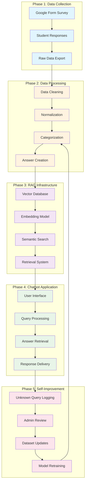
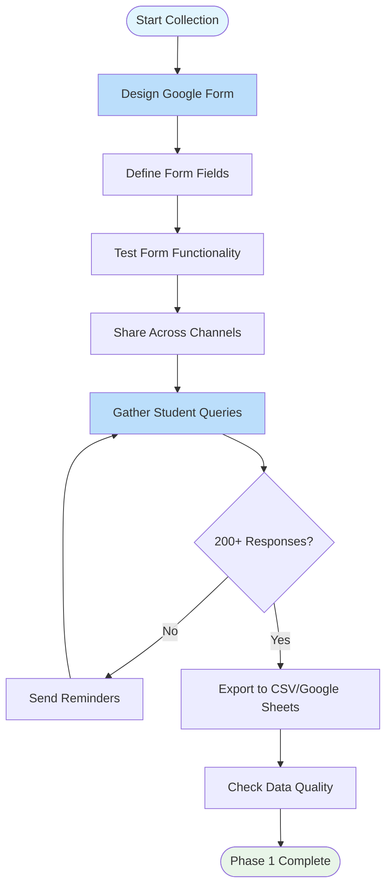
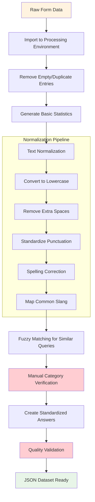
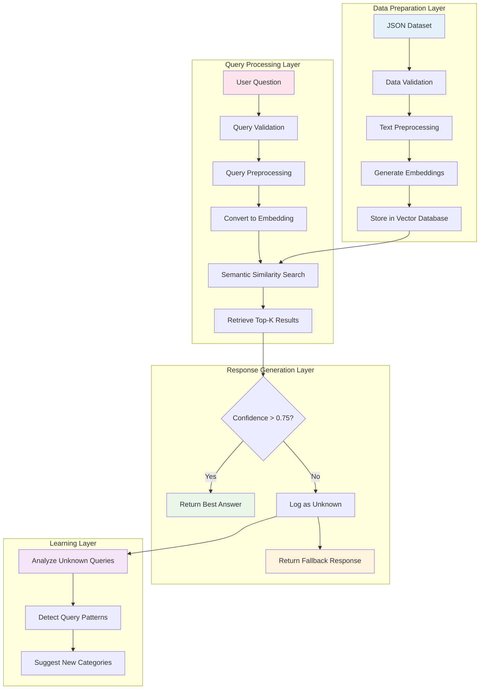
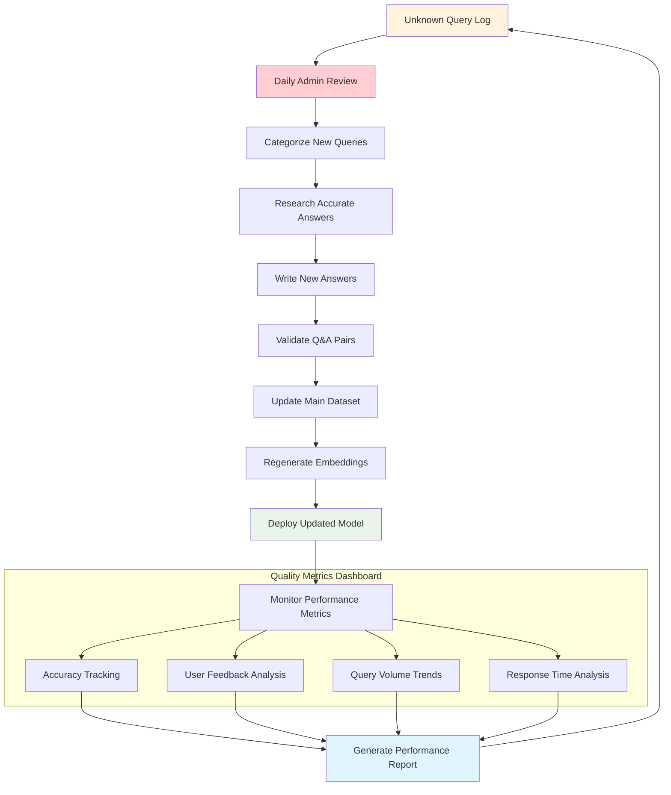

# 📋 LPU Query Chatbot - Comprehensive Project Plan

## 🎯 Project Objectives

To build a self-improving RAG (Retrieval-Augmented Generation) chatbot system that provides instant, accurate answers to LPU student queries by collecting real student questions and continuously learning from user interactions.

---

## 🏗️ System Architecture Overview

---

## 📊 Detailed Phase Flowcharts

### Phase 1: Data Collection Pipeline

### Phase 2: Data Refinement Workflow

### Phase 3: RAG System Architecture

### Phase 4: Self-Improvement Loop

---

## 📅 Implementation Timeline

### Month 1: Foundation
- **Week 1-2**: Google Form design and testing
- **Week 3-4**: Initial data collection campaign

### Month 2: Data Processing
- **Week 5-6**: Data cleaning and categorization
- **Week 7-8**: Answer creation and validation

### Month 3: RAG Development
- **Week 9-10**: Vector database setup and embedding generation
- **Week 11-12**: Chatbot backend development

### Month 4: Deployment & Testing
- **Week 13-14**: Frontend development and integration
- **Week 15-16**: Beta testing and optimization

### Month 5+: Continuous Improvement
- **Ongoing**: Monitor performance, collect feedback, expand dataset

---

## 🎯 Success Metrics & KPIs

### Data Collection Metrics
- **Target**: 200-500 initial queries
- **Diversity**: Coverage across all LPU departments
- **Quality**: ≥90% properly categorized queries

### System Performance Metrics
- **Accuracy**: >85% correct answers for known queries
- **Response Time**: <2 seconds per query
- **Coverage**: Answering capability for 80% of common questions

### Self-Improvement Metrics
- **Learning Rate**: 20+ new answers added monthly
- **User Satisfaction**: >80% positive feedback
- **Query Coverage**: 5% monthly increase in answerable queries

---

## ⚠️ Risk Assessment & Mitigation

### High Risk
- **Data Quality Issues**: Mitigate with manual review and validation
- **Low Student Participation**: Mitigate with incentives and multiple distribution channels

### Medium Risk
- **Technical Complexity**: Mitigate with phased development and expert consultation
- **Answer Accuracy**: Mitigate with admin approval workflow

### Low Risk
- **Scalability Issues**: Mitigate with modular architecture design
- **User Adoption**: Mitigate with intuitive interface and marketing

---

## 🛠 Resource Requirements

### Human Resources
- **Project Manager**: Overall coordination
- **Data Analyst**: Data processing and analysis
- **Full-Stack Developer**: System implementation
- **Content Specialist**: Answer creation and validation
- **UX Designer**: Interface design

### Technical Resources
- **Hosting**: Cloud infrastructure (AWS/Azure)
- **Database**: Vector database + relational database
- **AI/ML**: Embedding models and processing power
- **Development Tools**: IDEs, version control, testing tools

### Budget Considerations
- **Infrastructure**: $200-500/month
- **AI Services**: $100-300/month (if using external APIs)
- **Development Tools**: $50-100/month
- **Marketing**: $100-200/month for student engagement

---

## 🚀 Next Steps

1. **Immediate**: Set up Google Form and start data collection
2. **Short-term**: Process initial batch of data and prototype RAG system
3. **Medium-term**: Deploy MVP and gather user feedback
4. **Long-term**: Scale to full campus and integrate with existing LPU systems

---

## 📞 Project Coordination

- **Primary Stakeholder**: LPU Administration
- **Technical Lead**: Development Team
- **Content Approval**: Department Heads
- **User Testing**: Student Representatives

This comprehensive plan provides a solid foundation for building a successful LPU Query Chatbot system that will continuously improve and provide value to students across all departments.
