# 🤖 RAG System Architecture for LPU Query Chatbot

## 🎯 RAG System Objectives

Build a Retrieval-Augmented Generation (RAG) system that efficiently retrieves relevant answers from the LPU query dataset and generates accurate, contextually appropriate responses for student queries.

---

## 🏗️ RAG System Architecture Overview

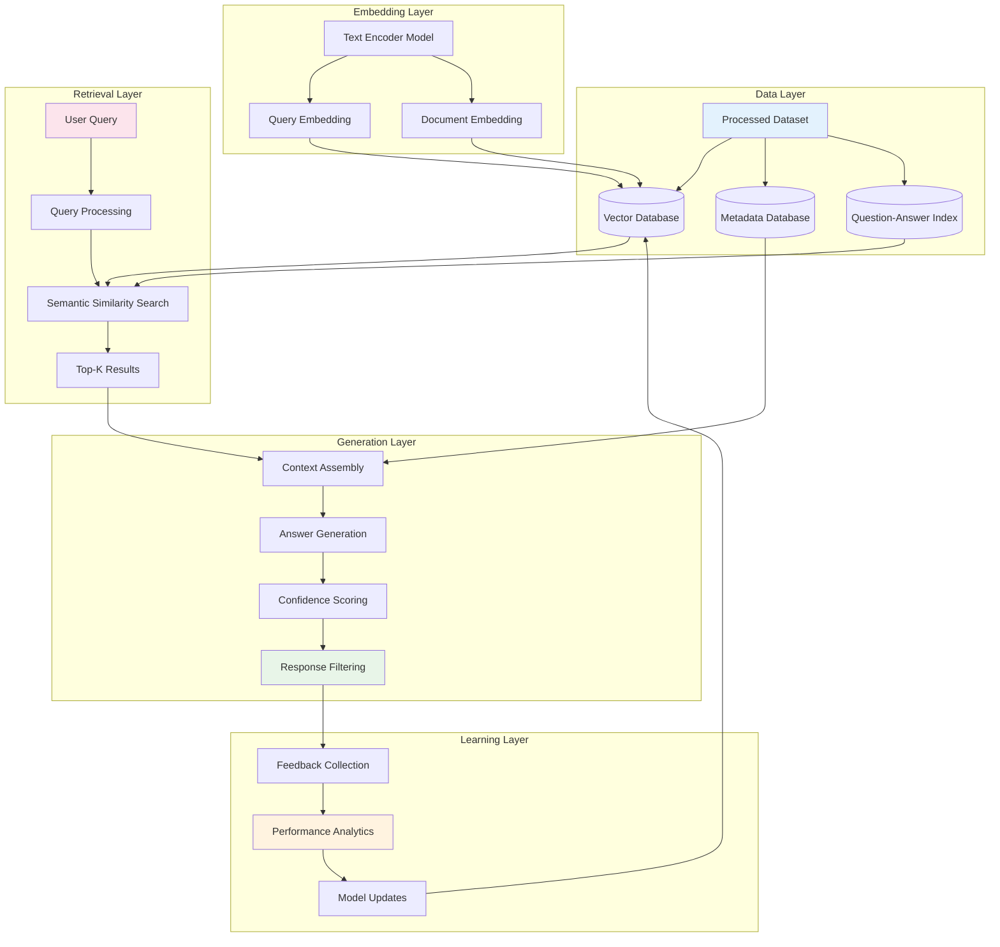
```mermaid
graph TB
    subgraph "Data Layer"
        Dataset[Processed Dataset] --> VectorDB[(Vector Database)]
        Dataset --> MetadataDB[(Metadata Database)]
        Dataset --> QAIndex[(Question-Answer Index)]
    end
    
    subgraph "Embedding Layer"
        TextEncoder[Text Encoder Model] --> QueryEmbedding[Query Embedding]
        TextEncoder --> DocumentEmbedding[Document Embedding]
        QueryEmbedding --> VectorDB
        DocumentEmbedding --> VectorDB
    end
    
    subgraph "Retrieval Layer"
        UserQuery[User Query] --> QueryProcessing[Query Processing]
        QueryProcessing --> SimilaritySearch[Semantic Similarity Search]
        SimilaritySearch --> TopKResults[Top-K Results]
    end
    
    subgraph "Generation Layer"
        TopKResults --> ContextAssembly[Context Assembly]
        ContextAssembly --> AnswerGeneration[Answer Generation]
        AnswerGeneration --> ConfidenceScoring[Confidence Scoring]
        ConfidenceScoring --> ResponseFilter[Response Filtering]
    end
    
    subgraph "Learning Layer"
        ResponseFilter --> FeedbackCollection[Feedback Collection]
        FeedbackCollection --> PerformanceAnalytics[Performance Analytics]
        PerformanceAnalytics --> ModelUpdates[Model Updates]
        ModelUpdates --> VectorDB
    end
    
    VectorDB --> SimilaritySearch
    MetadataDB --> ContextAssembly
    QAIndex --> SimilaritySearch
    
    style Dataset fill:#e3f2fd
    style UserQuery fill:#fce4ec
    style ResponseFilter fill:#e8f5e8
    style PerformanceAnalytics fill:#fff3e0
```

---

## 📚 Data Layer Architecture

### Vector Database Design

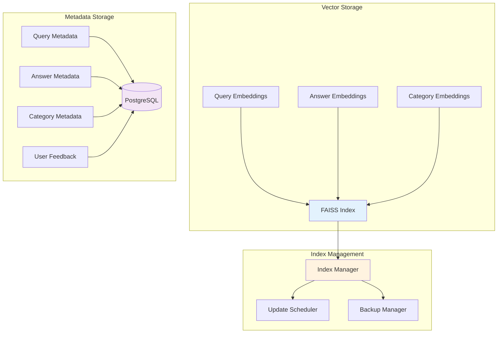
```mermaid
graph TB
    subgraph "Vector Storage"
        QueryVectors[Query Embeddings] --> FAISSIndex[FAISS Index]
        AnswerVectors[Answer Embeddings] --> FAISSIndex
        CategoryVectors[Category Embeddings] --> FAISSIndex
    end
    
    subgraph "Metadata Storage"
        QueryMetadata[Query Metadata] --> PostgreSQL[(PostgreSQL)]
        AnswerMetadata[Answer Metadata] --> PostgreSQL
        CategoryMetadata[Category Metadata] --> PostgreSQL
        UserFeedback[User Feedback] --> PostgreSQL
    end
    
    subgraph "Index Management"
        FAISSIndex --> IndexManager[Index Manager]
        IndexManager --> UpdateScheduler[Update Scheduler]
        IndexManager --> BackupManager[Backup Manager]
    end
    
    style FAISSIndex fill:#e3f2fd
    style PostgreSQL fill:#f3e5f5
    style IndexManager fill:#fff3e0
```

### Data Schema Design

```json
{
  "vector_schema": {
    "query_embedding": {
      "dimension": 384,
      "metric": "cosine",
      "index_type": "IVF_FLAT"
    },
    "answer_embedding": {
      "dimension": 384,
      "metric": "cosine", 
      "index_type": "IVF_FLAT"
    }
  },
  "metadata_schema": {
    "queries": {
      "id": "string",
      "text": "string",
      "category": "string",
      "subcategory": "string",
      "department": "string",
      "year": "string",
      "frequency": "string",
      "difficulty": "string",
      "embedding_id": "string",
      "created_at": "timestamp",
      "updated_at": "timestamp"
    },
    "answers": {
      "id": "string",
      "query_id": "string",
      "text": "string",
      "confidence_score": "float",
      "reviewed_by": "string",
      "embedding_id": "string",
      "created_at": "timestamp",
      "updated_at": "timestamp"
    }
  }
}
```

---

## 🔍 Retrieval System Design

### Query Processing Pipeline

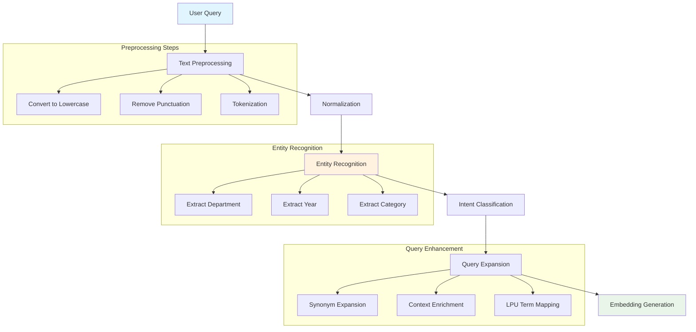
```mermaid
flowchart TD
    UserInput[User Query] --> Preprocessing[Text Preprocessing]
    Preprocessing --> Normalization[Normalization]
    Normalization --> EntityRecognition[Entity Recognition]
    EntityRecognition --> IntentClassification[Intent Classification]
    IntentClassification --> QueryExpansion[Query Expansion]
    QueryExpansion --> EmbeddingGeneration[Embedding Generation]
    
    subgraph "Preprocessing Steps"
        Preprocessing --> Lowercase[Convert to Lowercase]
        Preprocessing --> RemovePunctuation[Remove Punctuation]
        Preprocessing --> Tokenize[Tokenization]
    end
    
    subgraph "Entity Recognition"
        EntityRecognition --> DepartmentExtraction[Extract Department]
        EntityRecognition --> YearExtraction[Extract Year]
        EntityRecognition --> CategoryExtraction[Extract Category]
    end
    
    subgraph "Query Enhancement"
        QueryExpansion --> SynonymExpansion[Synonym Expansion]
        QueryExpansion --> ContextEnrichment[Context Enrichment]
        QueryExpansion --> LPUTermMapping[LPU Term Mapping]
    end
    
    style UserInput fill:#e1f5fe
    style EmbeddingGeneration fill:#e8f5e8
    style EntityRecognition fill:#fff3e0
```

### Semantic Search Algorithm

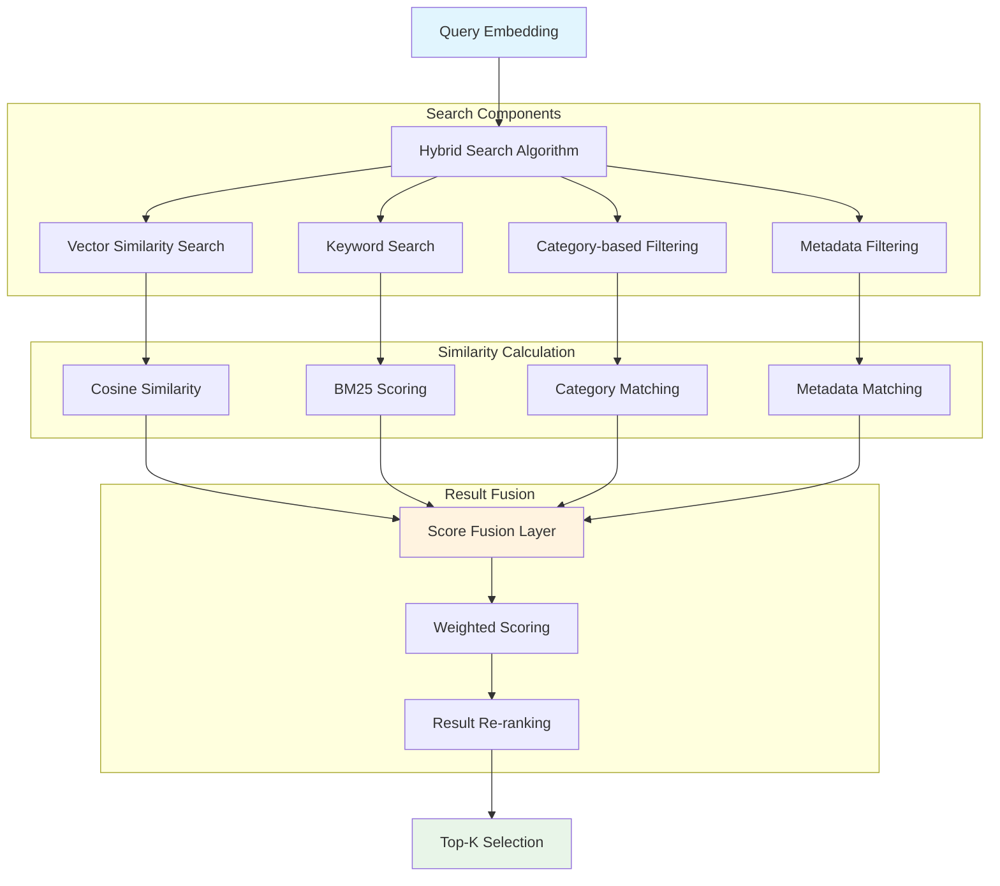
```mermaid
graph TB
    QueryEmbedding[Query Embedding] --> SearchAlgorithm[Hybrid Search Algorithm]
    
    subgraph "Search Components"
        SearchAlgorithm --> VectorSearch[Vector Similarity Search]
        SearchAlgorithm --> KeywordSearch[Keyword Search]
        SearchAlgorithm --> CategoryFilter[Category-based Filtering]
        SearchAlgorithm --> MetadataFilter[Metadata Filtering]
    end
    
    subgraph "Similarity Calculation"
        VectorSearch --> CosineSimilarity[Cosine Similarity]
        KeywordSearch --> BM25Score[BM25 Scoring]
        CategoryFilter --> CategoryMatch[Category Matching]
        MetadataFilter --> MetadataMatch[Metadata Matching]
    end
    
    subgraph "Result Fusion"
        CosineSimilarity --> ScoreFusion[Score Fusion Layer]
        BM25Score --> ScoreFusion
        CategoryMatch --> ScoreFusion
        MetadataMatch --> ScoreFusion
        
        ScoreFusion --> WeightedScoring[Weighted Scoring]
        WeightedScoring --> Reranking[Result Re-ranking]
    end
    
    Reranking --> TopKSelection[Top-K Selection]
    
    style QueryEmbedding fill:#e1f5fe
    style TopKSelection fill:#e8f5e8
    style ScoreFusion fill:#fff3e0
```

### Search Configuration

```python
# Search Configuration
search_config = {
    "vector_search": {
        "weight": 0.6,
        "top_k": 50,
        "similarity_threshold": 0.3
    },
    "keyword_search": {
        "weight": 0.3,
        "bm25_k1": 1.2,
        "bm25_b": 0.75
    },
    "category_filter": {
        "weight": 0.1,
        "boost_factor": 1.5
    },
    "final_selection": {
        "top_k": 5,
        "min_similarity": 0.5
    }
}
```

---

## ⚡ Embedding Strategy

### Embedding Model Selection

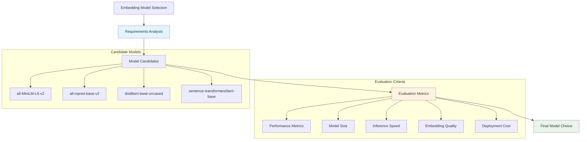
```mermaid
flowchart TD
    ModelSelection[Embedding Model Selection] --> Requirements[Requirements Analysis]
    Requirements --> ModelCandidates[Model Candidates]
    ModelCandidates --> Evaluation[Evaluation Metrics]
    Evaluation --> FinalSelection[Final Model Choice]
    
    subgraph "Evaluation Criteria"
        Evaluation --> Performance[Performance Metrics]
        Evaluation --> Size[Model Size]
        Evaluation --> Speed[Inference Speed]
        Evaluation --> Quality[Embedding Quality]
        Evaluation --> Cost[Deployment Cost]
    end
    
    subgraph "Candidate Models"
        ModelCandidates --> MiniLM[all-MiniLM-L6-v2]
        ModelCandidates --> MPNet[all-mpnet-base-v2]
        ModelCandidates --> DistilBERT[distilbert-base-uncased]
        ModelCandidates --> SentenceBERT[sentence-transformers/bert-base]
    end
    
    style Requirements fill:#e1f5fe
    style FinalSelection fill:#e8f5e8
    style Evaluation fill:#fff3e0
```

### Recommended Embedding Strategy

#### Primary Model: all-MiniLM-L6-v2
- **Dimension**: 384
- **Speed**: Fast inference
- **Quality**: Good balance of performance and accuracy
- **Size**: Small (80MB)

#### Specialized Embeddings for LPU Context
```python
lpu_specific_embeddings = {
    "academic_terms": {
        "model": "all-MiniLM-L6-v2",
        "fine_tuning_data": "lpu_academic_corpus",
        "specialization": "academic_language"
    },
    "admin_procedures": {
        "model": "all-MiniLM-L6-v2", 
        "fine_tuning_data": "lpu_admin_docs",
        "specialization": "procedural_language"
    },
    "student_life": {
        "model": "all-MiniLM-L6-v2",
        "fine_tuning_data": "lpu_student_faqs",
        "specialization": "informal_student_language"
    }
}
```

### Embedding Optimization

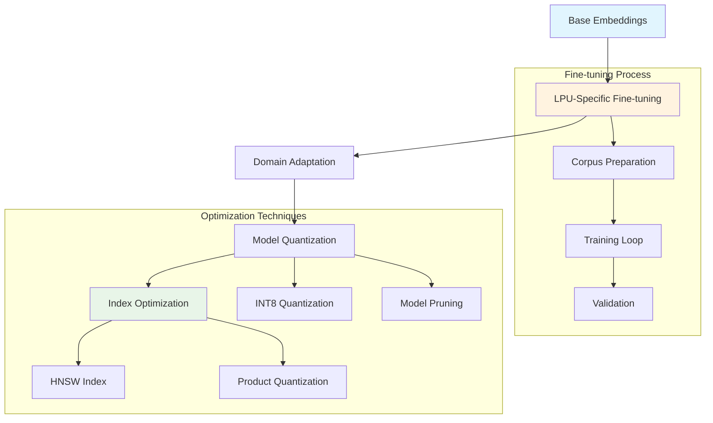
```mermaid
graph TB
    BaseEmbeddings[Base Embeddings] --> LPUFineTuning[LPU-Specific Fine-tuning]
    LPUFineTuning --> DomainAdaptation[Domain Adaptation]
    DomainAdaptation --> Quantization[Model Quantization]
    Quantization --> IndexOptimization[Index Optimization]
    
    subgraph "Fine-tuning Process"
        LPUFineTuning --> CorpusPreparation[Corpus Preparation]
        CorpusPreparation --> TrainingLoop[Training Loop]
        TrainingLoop --> Validation[Validation]
    end
    
    subgraph "Optimization Techniques"
        Quantization --> INT8Quantization[INT8 Quantization]
        Quantization --> Pruning[Model Pruning]
        IndexOptimization --> HNSWIndex[HNSW Index]
        IndexOptimization --> ProductQuantization[Product Quantization]
    end
    
    style BaseEmbeddings fill:#e1f5fe
    style IndexOptimization fill:#e8f5e8
    style LPUFineTuning fill:#fff3e0
```

---

## 🎯 Answer Generation System

### Response Generation Pipeline

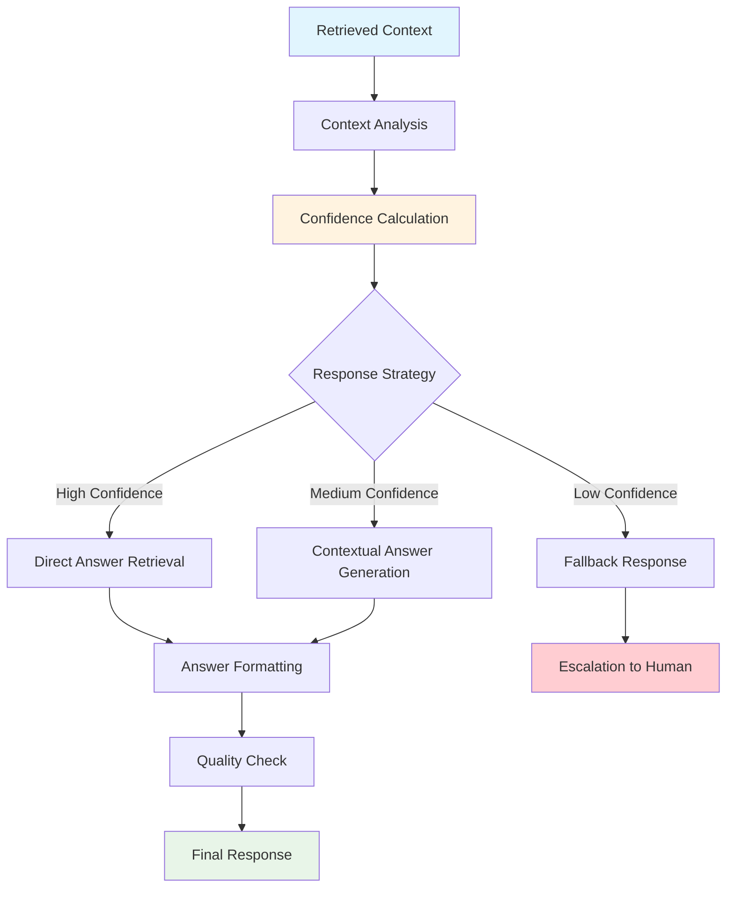
```mermaid
flowchart TD
    RetrievedContext[Retrieved Context] --> ContextAnalysis[Context Analysis]
    ContextAnalysis --> ConfidenceCalculation[Confidence Calculation]
    ConfidenceCalculation --> ResponseStrategy{Response Strategy}
    
    ResponseStrategy -->|High Confidence| DirectAnswer[Direct Answer Retrieval]
    ResponseStrategy -->|Medium Confidence| ContextualAnswer[Contextual Answer Generation]
    ResponseStrategy -->|Low Confidence| FallbackResponse[Fallback Response]
    
    DirectAnswer --> AnswerFormatting[Answer Formatting]
    ContextualAnswer --> AnswerFormatting
    FallbackResponse --> Escalation[Escalation to Human]
    
    AnswerFormatting --> QualityCheck[Quality Check]
    QualityCheck --> FinalResponse[Final Response]
    
    style RetrievedContext fill:#e1f5fe
    style FinalResponse fill:#e8f5e8
    style ConfidenceCalculation fill:#fff3e0
    style Escalation fill:#ffcdd2
```

### Confidence Scoring Algorithm

```python
# Confidence Scoring Components
confidence_components = {
    "semantic_similarity": {
        "weight": 0.4,
        "threshold": 0.75
    },
    "query_answer_match": {
        "weight": 0.3,
        "threshold": 0.7
    },
    "category_consistency": {
        "weight": 0.2,
        "threshold": 0.8
    },
    "answer_quality": {
        "weight": 0.1,
        "threshold": 0.9
    }
}

def calculate_confidence(semantic_score, qa_match, category_score, quality_score):
    weighted_score = (
        semantic_score * 0.4 +
        qa_match * 0.3 +
        category_score * 0.2 +
        quality_score * 0.1
    )
    return weighted_score
```

### Answer Formatting Templates

```mermaid
graph TB
    AnswerContent[Answer Content] --> FormatSelection[Format Selection]
    
    subgraph "Format Types"
        FormatSelection --> DirectResponse[Direct Response]
        FormatSelection --> StepByStep[Step-by-Step Guide]
        FormatSelection --> ContactInfo[Contact Information]
        FormatSelection --> MultipleOptions[Multiple Options]
    end
    
    subgraph "Template Variables"
        DirectResponse --> Template1[{{answer}}]
        StepByStep --> Template2[{{steps}}]
        ContactInfo --> Template3[{{contact_details}}]
        MultipleOptions --> Template4[{{options}}]
    end
    
    Template1 --> FinalFormatting[Final Formatting]
    Template2 --> FinalFormatting
    Template3 --> FinalFormatting
    Template4 --> FinalFormatting
    
    FinalFormatting --> ResponseOutput[Formatted Response]
    
    style AnswerContent fill:#e1f5fe
    style ResponseOutput fill:#e8f5e8
    style FormatSelection fill:#fff3e0
```

---

## 📊 Performance Optimization

### System Performance Metrics

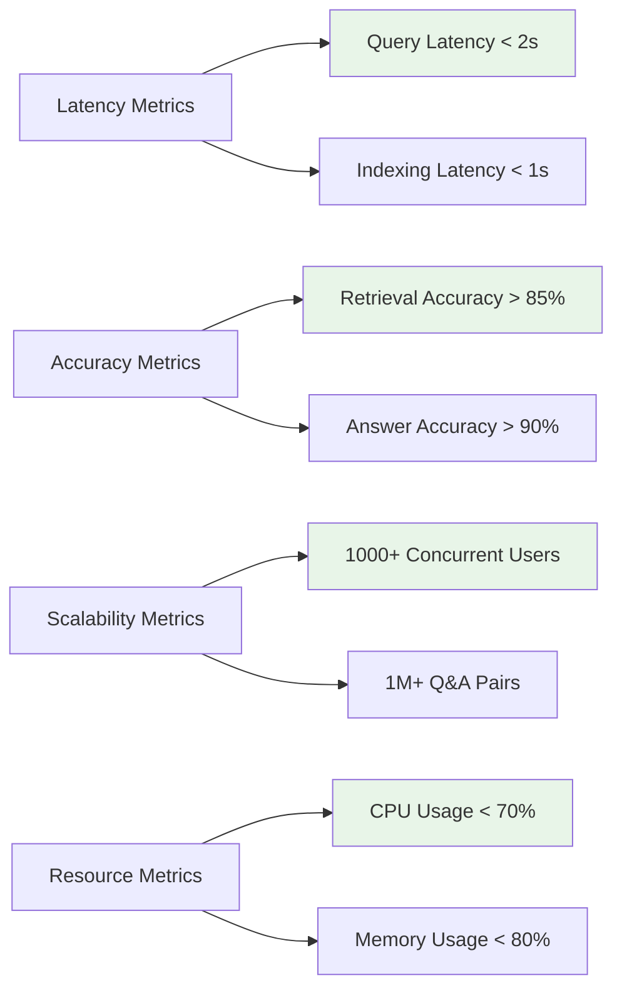
```mermaid
graph LR
    LatencyMetrics[Latency Metrics] --> QueryLatency[Query Latency < 2s]
    LatencyMetrics --> IndexingLatency[Indexing Latency < 1s]
    
    AccuracyMetrics[Accuracy Metrics] --> RetrievalAccuracy[Retrieval Accuracy > 85%]
    AccuracyMetrics --> AnswerAccuracy[Answer Accuracy > 90%]
    
    ScalabilityMetrics[Scalability Metrics] --> ConcurrentUsers[1000+ Concurrent Users]
    ScalabilityMetrics --> DatasetSize[1M+ Q&A Pairs]
    
    ResourceMetrics[Resource Metrics] --> CPUUsage[CPU Usage < 70%]
    ResourceMetrics --> MemoryUsage[Memory Usage < 80%]
    
    style QueryLatency fill:#e8f5e8
    style RetrievalAccuracy fill:#e8f5e8
    style ConcurrentUsers fill:#e8f5e8
    style CPUUsage fill:#e8f5e8
```

### Caching Strategy

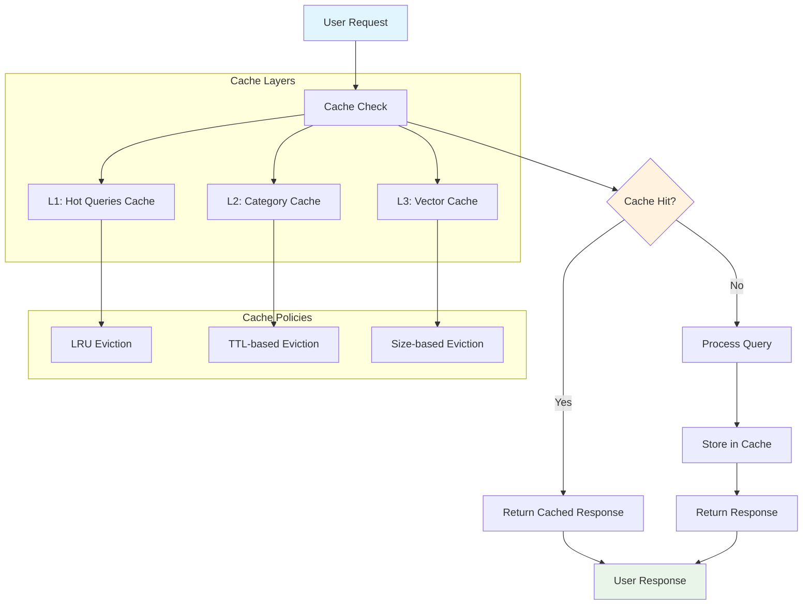
```mermaid
flowchart TD
    UserRequest[User Request] --> CacheCheck[Cache Check]
    CacheCheck --> CacheHit{Cache Hit?}
    CacheHit -->|Yes| ReturnCached[Return Cached Response]
    CacheHit -->|No| ProcessQuery[Process Query]
    ProcessQuery --> StoreCache[Store in Cache]
    StoreCache --> ReturnResponse[Return Response]
    
    subgraph "Cache Layers"
        CacheCheck --> L1Cache[L1: Hot Queries Cache]
        CacheCheck --> L2Cache[L2: Category Cache]
        CacheCheck --> L3Cache[L3: Vector Cache]
    end
    
    subgraph "Cache Policies"
        L1Cache --> LRU[LRU Eviction]
        L2Cache --> TTL[TTL-based Eviction]
        L3Cache --> SizeBased[Size-based Eviction]
    end
    
    ReturnCached --> UserResponse[User Response]
    ReturnResponse --> UserResponse
    
    style UserRequest fill:#e1f5fe
    style UserResponse fill:#e8f5e8
    style CacheHit fill:#fff3e0
```

### Load Balancing Architecture

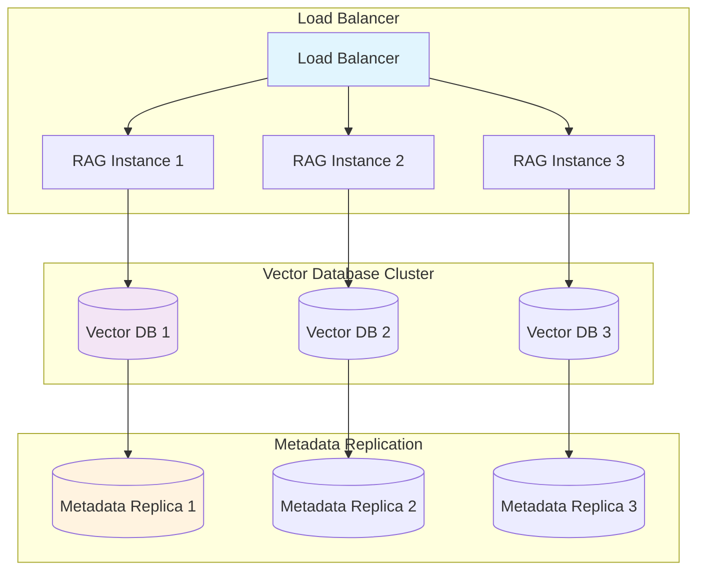
```mermaid
graph TB
    subgraph "Load Balancer"
        LB[Load Balancer] --> Instance1[RAG Instance 1]
        LB --> Instance2[RAG Instance 2]
        LB --> Instance3[RAG Instance 3]
    end
    
    subgraph "Vector Database Cluster"
        Instance1 --> VectorDB1[(Vector DB 1)]
        Instance2 --> VectorDB2[(Vector DB 2)]
        Instance3 --> VectorDB3[(Vector DB 3)]
    end
    
    subgraph "Metadata Replication"
        VectorDB1 --> MetaReplica1[(Metadata Replica 1)]
        VectorDB2 --> MetaReplica2[(Metadata Replica 2)]
        VectorDB3 --> MetaReplica3[(Metadata Replica 3)]
    end
    
    style LB fill:#e1f5fe
    style VectorDB1 fill:#f3e5f5
    style MetaReplica1 fill:#fff3e0
```

---

## 🔄 Learning & Improvement System

### Feedback Collection Pipeline

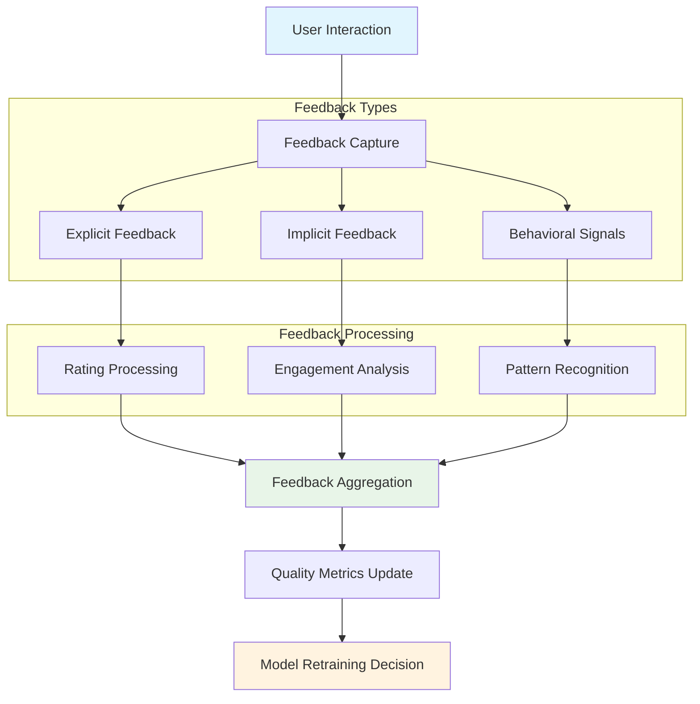
```mermaid
flowchart TD
    UserInteraction[User Interaction] --> FeedbackCapture[Feedback Capture]
    
    subgraph "Feedback Types"
        FeedbackCapture --> ExplicitFeedback[Explicit Feedback]
        FeedbackCapture --> ImplicitFeedback[Implicit Feedback]
        FeedbackCapture --> BehavioralSignals[Behavioral Signals]
    end
    
    subgraph "Feedback Processing"
        ExplicitFeedback --> RatingProcessing[Rating Processing]
        ImplicitFeedback --> EngagementAnalysis[Engagement Analysis]
        BehavioralSignals --> PatternRecognition[Pattern Recognition]
    end
    
    RatingProcessing --> FeedbackAggregation[Feedback Aggregation]
    EngagementAnalysis --> FeedbackAggregation
    PatternRecognition --> FeedbackAggregation
    
    FeedbackAggregation --> QualityMetrics[Quality Metrics Update]
    QualityMetrics --> ModelRetraining[Model Retraining Decision]
    
    style UserInteraction fill:#e1f5fe
    style FeedbackAggregation fill:#e8f5e8
    style ModelRetraining fill:#fff3e0
```

### Continuous Learning Workflow

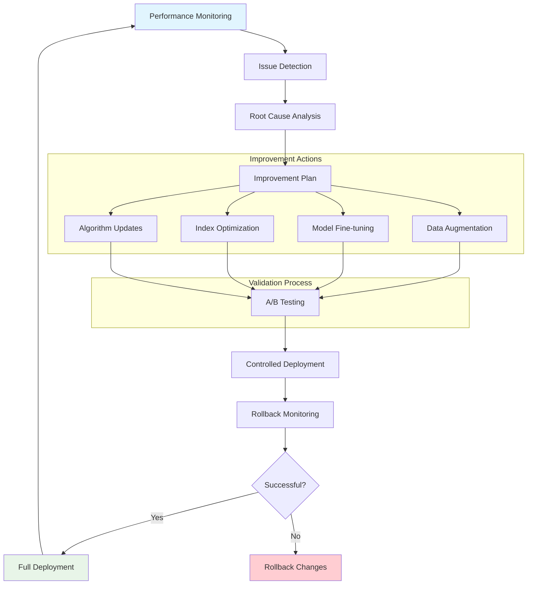
```mermaid
graph TB
    PerformanceMonitoring[Performance Monitoring] --> IssueDetection[Issue Detection]
    IssueDetection --> AnalysisRootCause[Root Cause Analysis]
    AnalysisRootCause --> ImprovementPlan[Improvement Plan]
    
    subgraph "Improvement Actions"
        ImprovementPlan --> DataAugmentation[Data Augmentation]
        ImprovementPlan --> ModelFineTuning[Model Fine-tuning]
        ImprovementPlan --> IndexOptimization[Index Optimization]
        ImprovementPlan --> AlgorithmUpdate[Algorithm Updates]
    end
    
    subgraph "Validation Process"
        DataAugmentation --> Validation[A/B Testing]
        ModelFineTuning --> Validation
        IndexOptimization --> Validation
        AlgorithmUpdate --> Validation
    end
    
    Validation --> DeploymentControl[Controlled Deployment]
    DeploymentControl --> RollbackMonitoring[Rollback Monitoring]
    
    RollbackMonitoring --> Success{Successful?}
    Success -->|Yes| FullDeployment[Full Deployment]
    Success -->|No| Rollback[Rollback Changes]
    
    FullDeployment --> PerformanceMonitoring
    
    style PerformanceMonitoring fill:#e1f5fe
    style FullDeployment fill:#e8f5e8
    style Rollback fill:#ffcdd2
```

---

## 🛠 Technical Implementation Stack

### Core Technologies

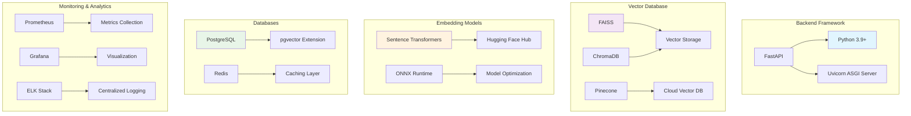
```mermaid
graph TB
    subgraph "Backend Framework"
        FastAPI[FastAPI] --> Python[Python 3.9+]
        FastAPI --> Uvicorn[Uvicorn ASGI Server]
    end
    
    subgraph "Vector Database"
        FAISS[FAISS] --> VectorStorage[Vector Storage]
        ChromaDB[ChromaDB] --> VectorStorage
        Pinecone[Pinecone] --> CloudVector[Cloud Vector DB]
    end
    
    subgraph "Embedding Models"
        SentenceTransformers[Sentence Transformers] --> HuggingFace[Hugging Face Hub]
        ONNX[ONNX Runtime] --> ModelOptimization[Model Optimization]
    end
    
    subgraph "Databases"
        PostgreSQL[PostgreSQL] --> PgVector[pgvector Extension]
        Redis[Redis] --> CachingLayer[Caching Layer]
    end
    
    subgraph "Monitoring & Analytics"
        Prometheus[Prometheus] --> MetricsCollection[Metrics Collection]
        Grafana[Grafana] --> Visualization[Visualization]
        ELKStack[ELK Stack] --> Logging[Centralized Logging]
    end
    
    style Python fill:#e1f5fe
    style FAISS fill:#f3e5f5
    style SentenceTransformers fill:#fff3e0
    style PostgreSQL fill:#e8f5e8
```

### Deployment Architecture

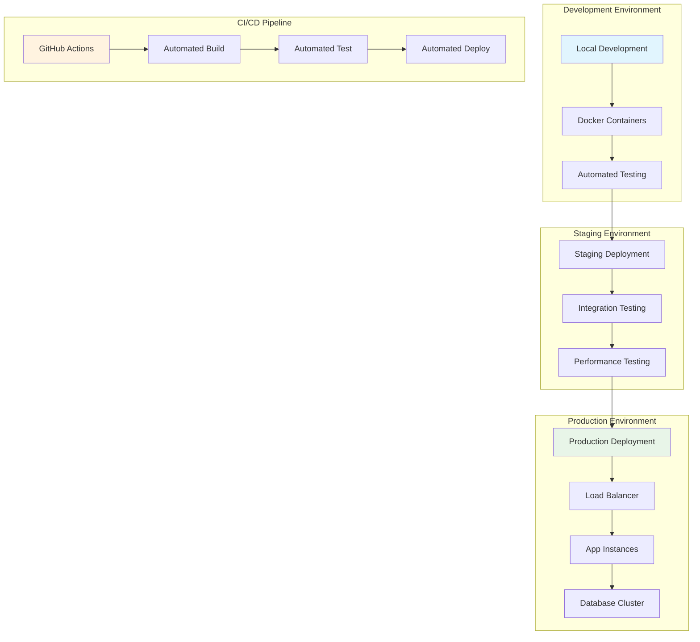
```mermaid
graph TB
    subgraph "Development Environment"
        DevLocal[Local Development] --> Docker[Docker Containers]
        Docker --> DevTesting[Automated Testing]
    end
    
    subgraph "Staging Environment"
        DevTesting --> StagingDeploy[Staging Deployment]
        StagingDeploy --> IntegrationTesting[Integration Testing]
        IntegrationTesting --> PerformanceTesting[Performance Testing]
    end
    
    subgraph "Production Environment"
        PerformanceTesting --> ProductionDeploy[Production Deployment]
        ProductionDeploy --> LoadBalancer[Load Balancer]
        LoadBalancer --> AppInstances[App Instances]
        AppInstances --> DatabaseCluster[Database Cluster]
    end
    
    subgraph "CI/CD Pipeline"
        GitHubActions[GitHub Actions] --> AutomatedBuild[Automated Build]
        AutomatedBuild --> AutomatedTest[Automated Test]
        AutomatedTest --> AutomatedDeploy[Automated Deploy]
    end
    
    style DevLocal fill:#e1f5fe
    style ProductionDeploy fill:#e8f5e8
    style GitHubActions fill:#fff3e0
```

---

## 📈 Monitoring & Analytics

### Key Performance Indicators

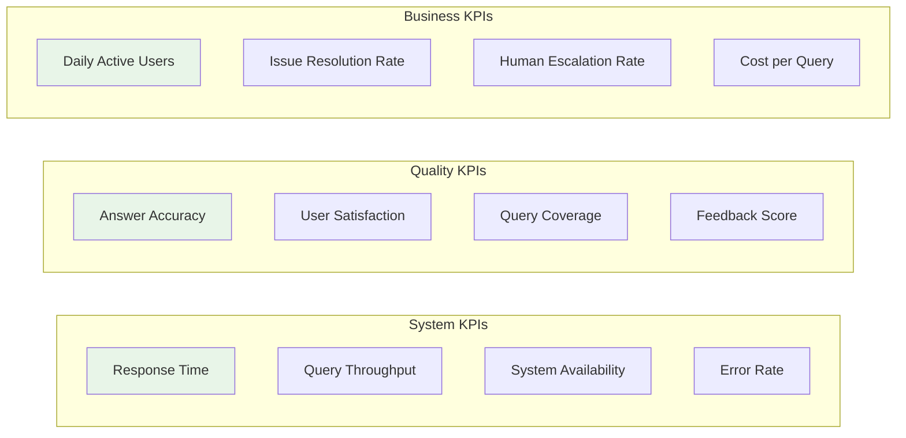
```mermaid
graph LR
    subgraph "System KPIs"
        ResponseTime[Response Time]
        Throughput[Query Throughput]
        Availability[System Availability]
        ErrorRate[Error Rate]
    end
    
    subgraph "Quality KPIs"
        AccuracyRate[Answer Accuracy]
        UserSatisfaction[User Satisfaction]
        CoverageRate[Query Coverage]
        FeedbackScore[Feedback Score]
    end
    
    subgraph "Business KPIs"
        UsageMetrics[Daily Active Users]
        ResolutionRate[Issue Resolution Rate]
        EscalationRate[Human Escalation Rate]
        CostPerQuery[Cost per Query]
    end
    
    style ResponseTime fill:#e8f5e8
    style AccuracyRate fill:#e8f5e8
    style UsageMetrics fill:#e8f5e8
```

### Real-time Monitoring Dashboard

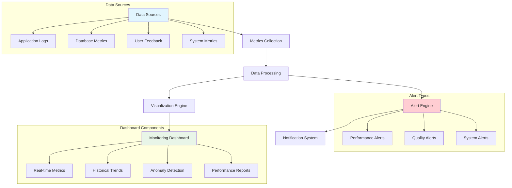
```mermaid
flowchart TD
    DataSources[Data Sources] --> MetricsCollection[Metrics Collection]
    
    subgraph "Data Sources"
        DataSources --> AppLogs[Application Logs]
        DataSources --> DatabaseMetrics[Database Metrics]
        DataSources --> UserFeedback[User Feedback]
        DataSources --> SystemMetrics[System Metrics]
    end
    
    MetricsCollection --> DataProcessing[Data Processing]
    DataProcessing --> AlertEngine[Alert Engine]
    DataProcessing --> VisualizationEngine[Visualization Engine]
    
    AlertEngine --> NotificationSystem[Notification System]
    VisualizationEngine --> Dashboard[Monitoring Dashboard]
    
    subgraph "Alert Types"
        AlertEngine --> PerformanceAlerts[Performance Alerts]
        AlertEngine --> QualityAlerts[Quality Alerts]
        AlertEngine --> SystemAlerts[System Alerts]
    end
    
    subgraph "Dashboard Components"
        Dashboard --> RealTimeMetrics[Real-time Metrics]
        Dashboard --> HistoricalTrends[Historical Trends]
        Dashboard --> AnomalyDetection[Anomaly Detection]
        Dashboard --> PerformanceReports[Performance Reports]
    end
    
    style DataSources fill:#e1f5fe
    style Dashboard fill:#e8f5e8
    style AlertEngine fill:#ffcdd2
```

---

## 🔒 Security & Privacy

### Security Architecture

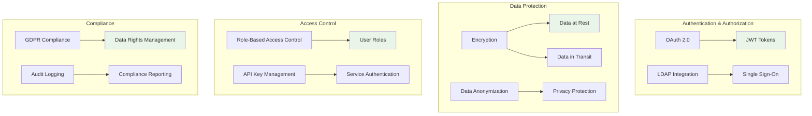
```mermaid
graph TB
    subgraph "Authentication & Authorization"
        OAuth2[OAuth 2.0] --> JWT[JWT Tokens]
        LDAP[LDAP Integration] --> SSO[Single Sign-On]
    end
    
    subgraph "Data Protection"
        Encryption[Encryption] --> DataAtRest[Data at Rest]
        Encryption --> DataInTransit[Data in Transit]
        Anonymization[Data Anonymization] --> PrivacyProtection[Privacy Protection]
    end
    
    subgraph "Access Control"
        RBAC[Role-Based Access Control] --> UserRoles[User Roles]
        APIKeys[API Key Management] --> ServiceAuthentication[Service Authentication]
    end
    
    subgraph "Compliance"
        GDPR[GDPR Compliance] --> DataRights[Data Rights Management]
        Auditing[Audit Logging] --> ComplianceReporting[Compliance Reporting]
    end
    
    style JWT fill:#e8f5e8
    style DataAtRest fill:#e8f5e8
    style UserRoles fill:#e8f5e8
    style DataRights fill:#e8f5e8
```

### Privacy Protection Measures

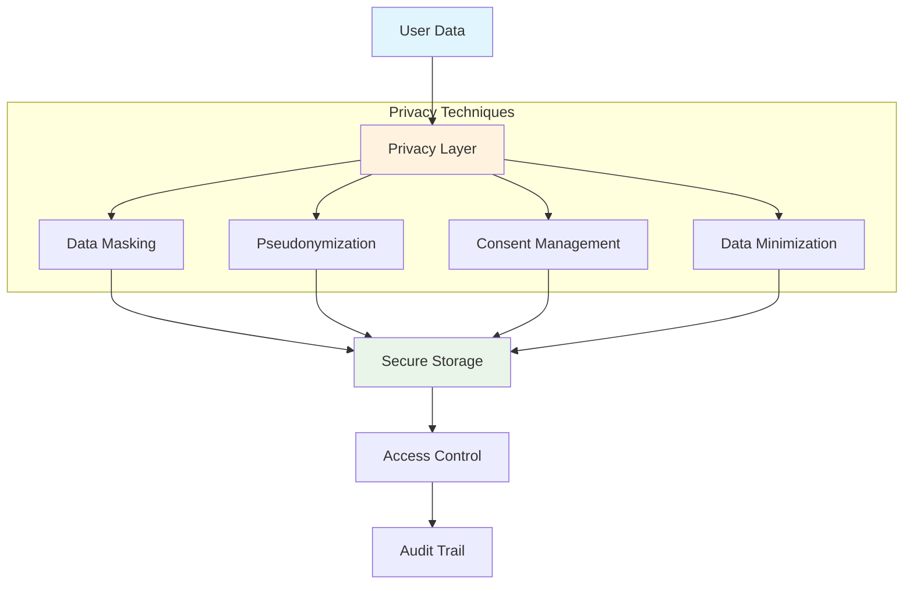
```mermaid
flowchart TD
    UserData[User Data] --> PrivacyLayer[Privacy Layer]
    
    subgraph "Privacy Techniques"
        PrivacyLayer --> DataMasking[Data Masking]
        PrivacyLayer --> Pseudonymization[Pseudonymization]
        PrivacyLayer --> ConsentManagement[Consent Management]
        PrivacyLayer --> DataMinimization[Data Minimization]
    end
    
    DataMasking --> SecureStorage[Secure Storage]
    Pseudonymization --> SecureStorage
    ConsentManagement --> SecureStorage
    DataMinimization --> SecureStorage
    
    SecureStorage --> AccessControl[Access Control]
    AccessControl --> AuditTrail[Audit Trail]
    
    style UserData fill:#e1f5fe
    style SecureStorage fill:#e8f5e8
    style PrivacyLayer fill:#fff3e0
```

This comprehensive RAG architecture provides a robust, scalable, and intelligent system for answering LPU student queries with high accuracy and continuous improvement capabilities.
