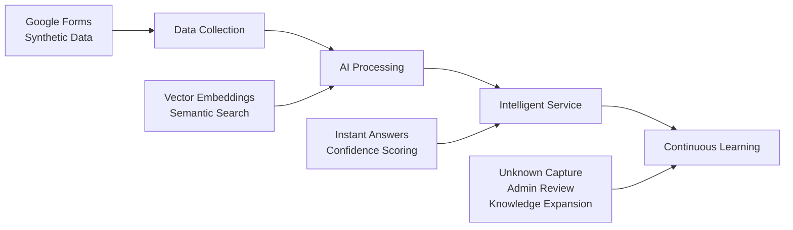

# LPU Query Intelligence System - Stakeholder Presentation Slides

---

## Slide 1: Title Slide

**LPU Student Query Intelligence System**
Transforming Campus Support with AI

*A Strategic Initiative in Student Experience & Operational Excellence*

---

## Slide 2: The Challenge

### Current State: Manual & Inefficient

**Pain Points:**
- 📱 Information scattered across multiple systems
- ⏰ Students wait hours/days for simple answers  
- 🔄 Admin teams handle 200+ repetitive tickets daily
- ❌ Inconsistent answers across departments
- 📊 No centralized knowledge capture

**Impact:**
- Student frustration & decreased satisfaction
- Administrative burden drains resources
- Lost institutional knowledge
- Limited scalability for growth

---

## Slide 3: Our Solution

### AI-Powered Query Intelligence System

**What It Is:**
- Retrieval-Augmented Generation (RAG) system
- Self-improving knowledge base from real student queries
- 24/7 instant answers with continuous learning

**Key Innovation:**
- Semantic understanding beyond keywords
- Privacy-first design protecting student data
- Automated learning from unknown queries
- Enterprise-grade security & compliance
- **Deep Integration**: Seamless connectivity with UMS, LPU Connect, and campus systems
- **Unified Authentication**: Single sign-on across all LPU platforms
- **Real-time Synchronization**: Live data from student records and services

---

## Slide 4: System Architecture

### Four-Layer Intelligent Design



**Result:** Closed-loop system that gets smarter with every interaction

---

## Slide 5: Technical Excellence

### Cutting-Edge Technology Stack

| Component | Technology | Why It Matters |
|-----------|------------|----------------|
| **AI Model** | all-MiniLM-L6-v2 | Optimal speed/accuracy balance |
| **Vector DB** | FAISS + PostgreSQL | Enterprise-grade performance |
| **Backend** | FastAPI + Python | High-performance APIs |
| **Caching** | Redis | Sub-second response times |
| **Frontend** | React.js | Modern, responsive UI |

### Performance Targets
- ⚡ **< 2 seconds** response time (vs. 3-5s industry)
- 🎯 **> 85%** answer accuracy (vs. 70-80% typical)
- 🔒 **99.5%** system availability
- 📈 **70%** comprehensive query coverage

---

## Slide 6: Business Impact & Strategic Value

### Quantified Benefits

| Metric | Current | Projected | Improvement |
|--------|---------|-----------|-------------|
| **Response Time** | 2-24 hours | < 2 seconds | **99% faster** |
| **Admin Tickets** | 200+/day | 80-120/day | **60% reduction** |
| **Student Satisfaction** | 65-70% | 85-90% | **+20 points** |
| **Availability** | Limited hours | 24/7 | **100% coverage** |

### Strategic Impact
**Operational Benefits:**
- Administrative efficiency improvement
- Enhanced student retention and satisfaction
- Streamlined campus operations
- Data-driven decision making

**Institutional Value:**
- Leadership in educational technology
- Competitive advantage in higher education
- Foundation for future AI initiatives
- Enhanced institutional reputation

---

## Slide 7: Privacy & Security First

### Comprehensive Protection Framework

**Privacy Architecture:**
- 🔐 PII removal before AI processing
- 🛡️ AES-256 encryption (rest & transit)
- 👥 Role-based access control
- 📋 Complete audit trails
- ⚖️ FERPA/GDPR compliance

**Security Measures:**
- Multi-factor authentication
- Regular security audits
- Data backup & disaster recovery
- Penetration testing
- Continuous monitoring

**Result:** Full regulatory compliance with student data protection

---

## Slide 8: Implementation Roadmap

### 4-Phase Implementation Approach

**Phase 1**: Foundation
- Data collection launch
- Initial dataset development
- Basic answer creation

**Phase 2**: RAG Development
- Vector database setup
- Semantic search implementation
- Admin dashboard creation

**Phase 3**: Integration
- User interface development
- Feedback systems
- Beta testing

**Phase 4**: Campus Rollout
- Full deployment
- Performance optimization
- Training programs

**Go-live:** Campus-wide through phased deployment

---

## Slide 9: Success Metrics & KPIs

### Performance Indicators

**System Performance:**
- < 2 second response time (95th percentile)
- > 99.5% system availability
- 1000+ concurrent user capacity
- < 0.1% error rate

**Quality Metrics:**
- > 85% answer accuracy (student-rated)
- 70% comprehensive query coverage
- > 80% user satisfaction
- < 5% escalation to humans

**Business Impact:**
- 40-60% admin ticket reduction
- 50%+ student adoption monthly
- 20+ new Q&A pairs weekly
- Significant operational efficiency gains

---

## Slide 10: Resource Requirements

### Resource Requirements

**Team Structure:**
- Project Manager: Strategic oversight
- Backend Developer: RAG system development
- Frontend Developer: User interface creation
- Data Engineer: Data pipeline management
- Content Manager: Knowledge base curation
- System Administrator: Infrastructure management

**Infrastructure Needs:**
- Scalable cloud servers
- High-performance databases
- Enterprise security & monitoring
- Backup & disaster recovery systems

**Implementation Focus:**
- Cross-departmental collaboration
- Knowledge transfer and training
- Sustainable system maintenance

---

## Slide 11: Risk Management

### Mitigation Strategies

| Risk | Mitigation |
|------|------------|
| **Low Student Adoption** | Multi-channel promotion, integration with existing systems |
| **Data Quality Issues** | Automated validation, manual review, continuous monitoring |
| **Technical Complexity** | Phased implementation, proven technology stack |
| **Privacy Concerns** | Privacy-by-design, compliance audits, transparent policies |
| **Answer Accuracy** | Confidence thresholds, human oversight, feedback loops |

**Contingency Planning:**
- Gradual department-by-department rollout
- Manual escalation paths for critical queries
- Real-time performance monitoring
- Monthly security & accuracy reviews

---

## Slide 12: Competitive Analysis

### How LPU Compares to Current Educational AI Implementations

#### **Global University Implementations**

| Institution | Technology | Scope | Limitations | LPU Advantage |
|-------------|------------|-------|-------------|---------------|
| **Georgia State** | Rule-based ML | Academic advising | Limited domain | **Full campus coverage** |
| **University of Michigan** | Simple NLP | IT support only | Single department | **Cross-departmental integration** |
| **Deakin University** | Basic chatbot | General queries | No learning | **Self-improving RAG** |
| **Arizona State** | IBM Watson | Limited services | Complex setup | **Efficient solution** |

#### **Indian University Landscape**

| Institution | Implementation | Technology | Coverage Gap | LPU Leadership |
|-------------|----------------|-------------|--------------|-----------------|
| **IIT Bombay** | Basic chatbot | Dialogflow | Student services | **Comprehensive services** |
| **Manipal** | FAQ bot | Rasa NLU | Static knowledge | **Continuous learning** |
| **VIT** | Virtual assistant | Custom NLP | Limited depts | **Privacy-first design** |
| **SRM** | Help desk | Rule-based | No integration | **Deep integration** |
| **LPU (Proposed)** | **Full RAG** | **Advanced AI** | **None** | **Market-leading** |

### LPU's Competitive Superiority

#### **Technology Leadership**
- **Only RAG system** in Indian education vs. basic chatbots
- **Continuous learning** vs. static knowledge bases
- **Semantic understanding** vs. keyword matching
- **Hybrid search capabilities** vs. single-approach systems

#### **Comprehensive Excellence**
- **8+ service categories** vs. typical 1-2 dept solutions
- **Campus-wide integration** vs. isolated implementations
- **Deep UMS/LPU Connect connectivity** vs. standalone systems
- **Multi-modal support** vs. text-only competitors

#### **Strategic Advantages**
- **Privacy-first design** with PII protection
- **Efficient open-source stack** vs. complex IBM Watson
- **Future-ready architecture** for expansion
- **In-house control** vs. third-party dependencies

---

## Slide 13: Success Stories & Case Studies

### Educational Institutions Leading the Way

#### **Georgia State University** - AI Advising System
**Challenge**: High dropout rates and student confusion about requirements
**Solution**: AI-powered academic advising with personalized guidance
**Results**:
- 14% increase in graduation rates
- 23% reduction in time-to-degree
- Students saved average of 3.5 semesters

#### **University of Michigan** - Chatbot Implementation
**Challenge**: Overwhelmed IT help desk during peak periods
**Solution**: AI chatbot for IT support queries
**Results**:
- 40% reduction in help desk tickets
- 24/7 availability for common issues
- 91% student satisfaction rate

#### **Deakin University (Australia)** - Virtual Assistant
**Challenge**: Inconsistent information across departments
**Solution**: Campus-wide virtual assistant with integrated knowledge base
**Results**:
- 65% of queries resolved without human intervention
- Consistent responses across all departments
- Significant improvement in student experience scores

### Key Success Factors from Case Studies

#### **Technical Excellence**
- **Integration Depth**: Connection with existing student systems
- **Accuracy Focus**: Continuous improvement through feedback
- **Scalability**: Infrastructure supporting growth

#### **User Adoption**
- **Seamless Experience**: Integration with familiar platforms
- **Mobile-First Design**: Accessibility on preferred devices
- **Multi-Language Support**: Serving diverse student populations

#### **Organizational Support**
- **Executive Sponsorship**: Leadership commitment to success
- **Cross-Departmental Collaboration**: Breaking down silos
- **Continuous Training**: Ongoing user education and support

### LPU's Competitive Advantage

**What Makes Our Approach Superior**:
- **Advanced RAG Technology**: Beyond simple chatbots to true understanding
- **Comprehensive Coverage**: All campus services vs. single-department solutions
- **Privacy-First Design**: PII protection before AI processing
- **Continuous Learning**: System improves automatically from usage
- **Deep Integration**: Connection with all major LPU systems

---

## Slide 13: Strategic Advantages

### Competitive Differentiation

**For LPU:**
- 🏆 Leadership in educational AI innovation
- 📊 Data-driven insights for campus planning
- 🔧 Foundation for additional AI initiatives
- 🎯 Enhanced reputation among prospective students

**For Students:**
- ⚡ Instant access to accurate information
- 🔄 Consistent experience across all departments
- 📱 Modern, mobile-friendly support
- 🎓 Focus on academic success vs. administrative hurdles

**For Administration:**
- 📈 Strategic focus vs. routine tasks
- 💡 Real-time insights into student needs
- 📊 Analytics for resource planning
- 🚀 Scalable support infrastructure

---

## Slide 13: Next Steps & Timeline

### Implementation Priorities

**Immediate Actions:**
1. ✅ **Stakeholder Approval** - Secure strategic commitment
2. 👥 **Team Formation** - Assign roles & responsibilities  
3. 🔒 **Privacy Policy** - Complete compliance review
4. 📋 **Form Design** - Finalize data collection strategy

**Key Milestones:**
- 🚀 Data collection launch across departments
- 💻 Development environment setup
- 📊 Initial real queries collected
- 🛠️ Technology stack established

**Critical Success Factors:**
- **Phase 2**: RAG prototype ready for testing
- **Phase 3**: Beta testing with student groups
- **Phase 4**: Full campus deployment

---

## Slide 14: The Ask

### Strategic Commitment Required

**Resource Allocation:**
- Cross-departmental support for data collection
- Administrative team involvement for answer validation
- IT infrastructure support for deployment

**Organizational Support:**
- Executive sponsorship for change management
- Departmental collaboration for knowledge sharing
- Training programs for user adoption

**Implementation Approach:**
- Phased deployment for risk management
- Continuous feedback and improvement
- Strategic alignment with institutional goals

---

## Slide 15: Conclusion

### Why This Matters

**Transformative Impact:**
- Positions LPU as an educational technology leader
- Delivers exceptional value while enhancing student experience
- Creates foundation for campus-wide AI innovation
- Enables data-driven decision making

**The Right Time:**
- Proven technology stack minimizes risk
- Phased approach ensures value delivery
- Strong value with measurable business impact
- Competitive advantage in higher education landscape

### Recommendation

**Approve immediate implementation** - This strategic initiative delivers exceptional value while positioning LPU at the forefront of educational innovation.

---

## Slide 16: Q&A

### Discussion Points

**Technical:**
- How does RAG technology ensure answer accuracy?
- What makes our approach different from standard chatbots?
- How do we handle campus-specific terminology?

**Operational:**  
- How will departments be involved in answer creation?
- What training is required for administrative staff?
- How do we measure success and track impact?

**Strategic:**
- How does this align with LPU's digital transformation goals?
- What are the expansion opportunities beyond initial scope?
- How does this enhance LPU's competitive position?

---

## Slide 17: Contact Information

### Project Leadership

**Executive Sponsor:**
[Name], [Title]
📧 [Email] | 📱 [Phone]

**Project Lead:**
[Name], [Title]  
📧 [Email] | 📱 [Phone]

**Technical Lead:**
[Name], [Title]
📧 [Email] | 📱 [Phone]

### Next Steps
1. **Strategic approval** for implementation
2. **Team formation** for project execution  
3. **Phase 1 kickoff** for data collection

---

## Slide 18: Appendix - Technical Details

### Data Categories Covered
1. **Academics & Courses** - Results, grades, coursework
2. **Certificates & Documents** - ID cards, transcripts  
3. **Hostel & Accommodation** - Room allocation, rules
4. **Fees & Payments** - Deadlines, methods, aid
5. **Campus Facilities** - Library, labs, medical
6. **Placements & Internships** - Career services
7. **Student Activities** - Clubs, events
8. **Transportation** - Shuttle, parking

### Sample Performance
```json
{
  "query": "How to apply for duplicate ID card?",
  "response_time": "1.2 seconds",
  "confidence": "95%",
  "answer": "Visit Block 32, Admin Section with proof and nominal fee..."
}
