# 🚀 Phase 1: Data Collection Implementation Guide

## 🎯 Phase Objectives

Successfully collect 200-500 authentic student queries from across all LPU departments using a well-designed Google Form and strategic distribution campaign.

---

## 📋 Implementation Timeline

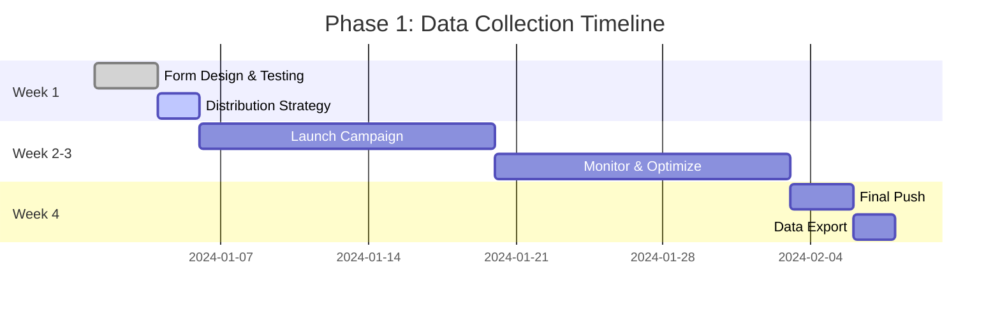

---

## 🛠 Step-by-Step Implementation

### Step 1: Google Form Setup

#### 1.1 Create Google Form
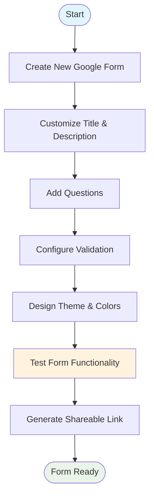

#### 1.2 Form Configuration Checklist

**Basic Settings:**
- [ ] Form title: "LPU Student Questions Survey - Help Build Your Campus Chatbot"
- [ ] Description: Include purpose, time estimate, and privacy statement
- [ ] Collect email addresses: Disabled (ensure anonymity)
- [ ] Limit to 1 response: Disabled (allow multiple entries for different questions)
- [ ] Show progress bar: Enabled
- [ ] Edit after submit: Disabled
- [ ] Confirmation message: Custom thank you message

**Question Implementation:**

| Question | Type | Required | Validation |
|----------|------|----------|------------|
| Name/Roll No | Short answer | ❌ | None |
| Program/Department | Dropdown | ✅ | Predefined list |
| Year of Study | Multiple choice | ✅ | Predefined options |
| Hosteller/Day Scholar | Multiple choice | ✅ | Two options only |
| Area of Question | Dropdown | ✅ | Predefined categories |
| Your Question | Paragraph | ✅ | Min 10 characters |
| Frequency | Multiple choice | ❌ | Predefined options |
| Additional Notes | Paragraph | ❌ | None |

#### 1.3 Testing Protocol

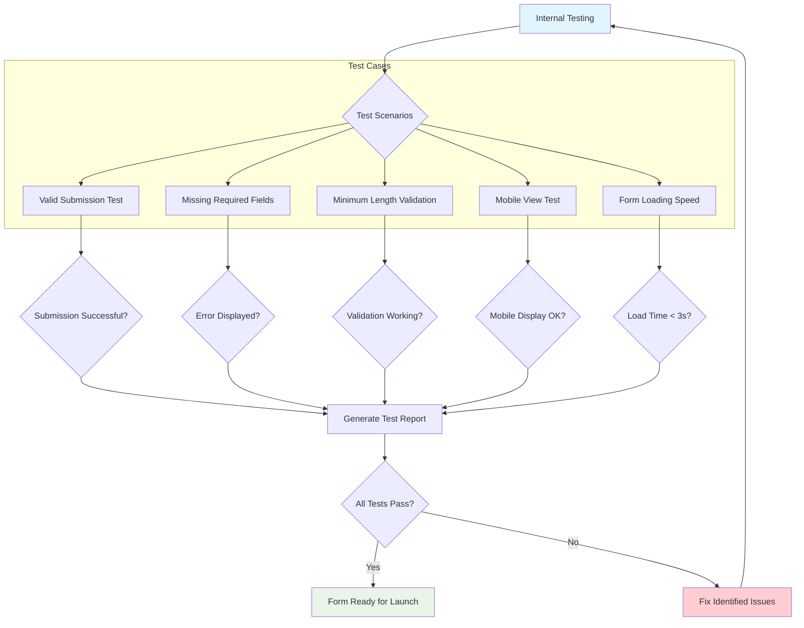

### Step 2: Distribution Strategy Implementation

#### 2.1 Digital Distribution Channels

```mermaid
flowchart TD
    DigitalChannels[Digital Channels] --> EmailCampaign[Email Campaign]
    DigitalChannels --> WhatsAppCampaign[WhatsApp Campaign]
    DigitalChannels --> SocialMedia[Social Media Posts]
    DigitalChannels --> LPUConnect[LPU Connect Portal]
    
    subgraph "Email Campaign"
        EmailCampaign --> StudentEmails[All Student Emails]
        EmailCampaign --> DepartmentEmails[Department Mailing Lists]
        EmailCampaign --> ClubEmails[Club Mailing Lists]
    end
    
    subgraph "WhatsApp Campaign"
        WhatsAppCampaign --> ClassGroups[Class WhatsApp Groups]
        WhatsAppCampaign --> HostelGroups[Hostel WhatsApp Groups]
        WhatsAppCampaign --> ClubGroups[Club WhatsApp Groups]
    end
    
    subgraph "Social Media"
        SocialMedia --> OfficialPages[LPU Official Pages]
        SocialMedia --> StudentGroups[Student Facebook Groups]
        SocialMedia --> Instagram[LPU Instagram]
    end
    
    subgraph "LPU Connect"
        LPUConnect --> PortalBanner[Portal Banner]
        LPUConnect --> Notifications[Push Notifications]
        LPUConnect --> StudentDashboard[Student Dashboard Widget]
    end
    
    style DigitalChannels fill:#e1f5fe
```

#### 2.2 Physical Distribution Channels

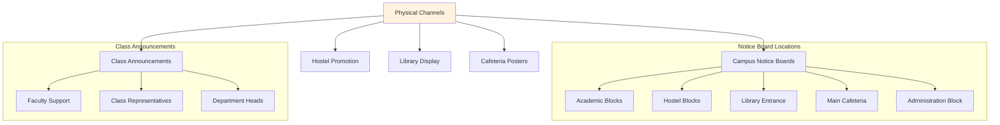

#### 2.3 Student Ambassador Program

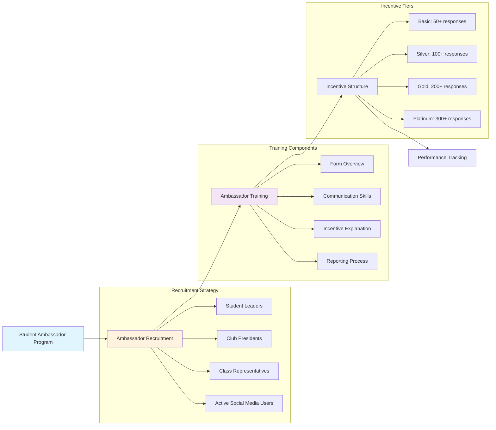

### Step 3: Campaign Execution

#### 3.1 Launch Day Preparation

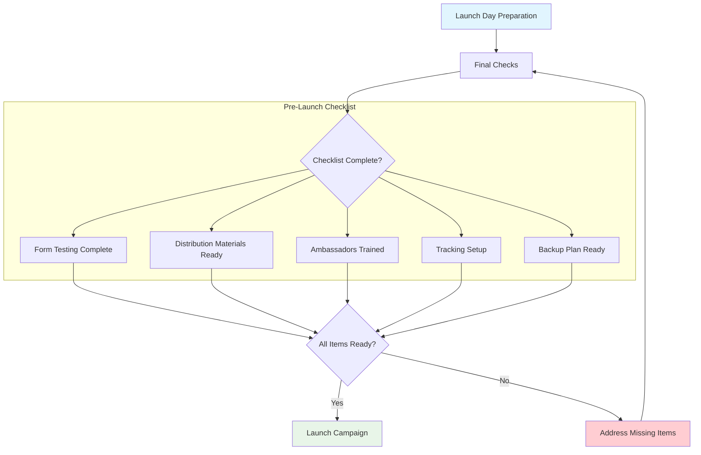

#### 3.2 Daily Monitoring Protocol

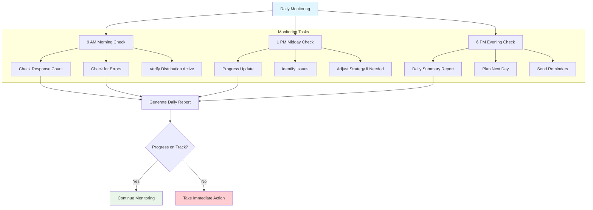

#### 3.3 Optimization Strategies

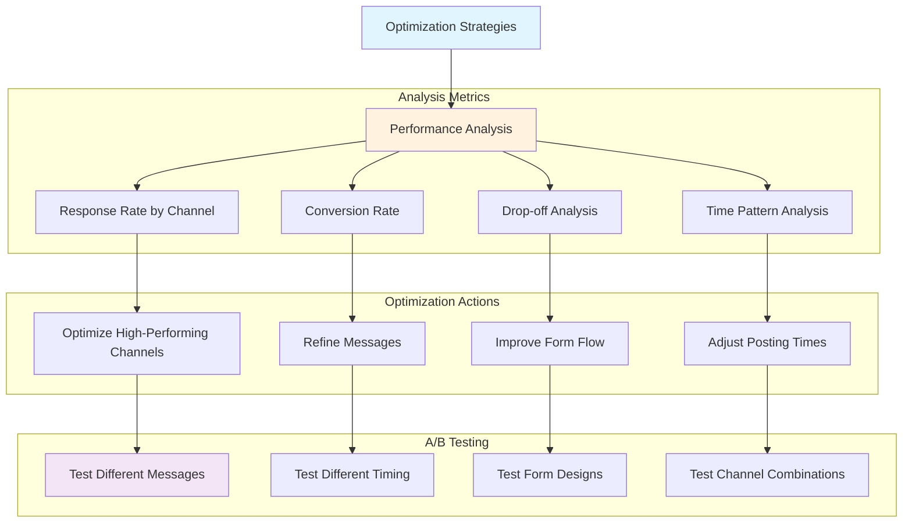

### Step 4: Quality Control & Validation

#### 4.1 Response Quality Monitoring

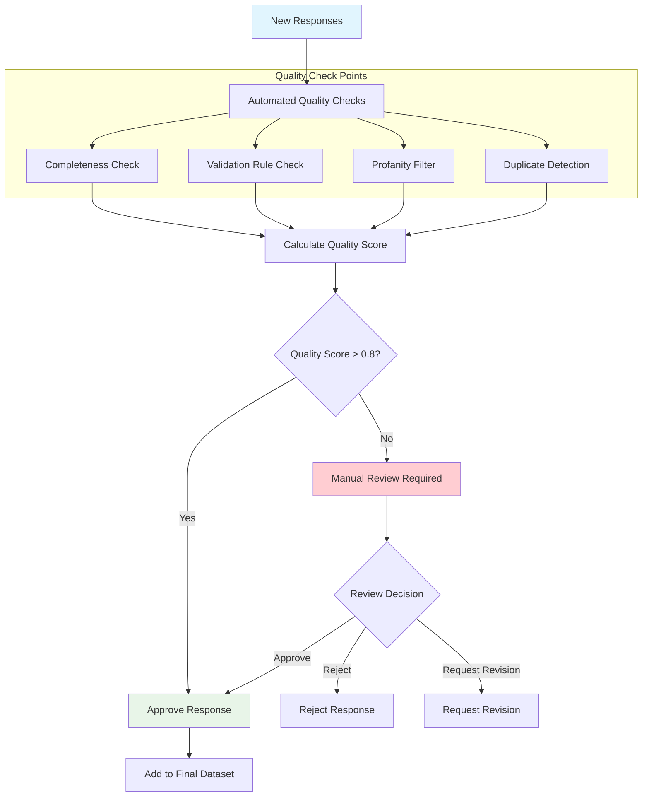

#### 4.2 Data Validation Rules

```python
# Quality Validation Rules Implementation
class ResponseValidator:
    def __init__(self):
        self.min_question_length = 10
        self.max_question_length = 1000
        self.required_fields = ['program_department', 'year_of_study', 'question_category', 'question_text']
        self.valid_categories = [
            "Admissions & Applications", "Academics & Courses", "Exams & Results",
            "Fees & Payments", "Hostel & Accommodation", "Transport & Parking",
            "Placements & Internships", "Campus Facilities", "Library Services",
            "Sports & Recreation", "Student Clubs & Activities", "Certificates & Documents",
            "IT Services & Support", "Health Services", "Career Guidance",
            "Scholarships & Financial Aid", "Exam Schedule", "Timetable & Classes",
            "Attendance Requirements", "Project Work & Thesis", "General Information"
        ]
    
    def validate_response(self, response_data):
        """Validate a single response"""
        quality_score = 0.0
        max_score = 4.0
        
        # Check required fields
        if all(field in response_data for field in self.required_fields):
            quality_score += 1.0
        
        # Check question length
        question_text = response_data.get('question_text', '')
        if self.min_question_length <= len(question_text) <= self.max_question_length:
            quality_score += 1.0
        
        # Check category validity
        category = response_data.get('question_category', '')
        if category in self.valid_categories:
            quality_score += 1.0
        
        # Check for meaningful content (basic quality check)
        if self._is_meaningful_content(question_text):
            quality_score += 1.0
        
        return quality_score / max_score
    
    def _is_meaningful_content(self, text):
        """Check if content is meaningful"""
        # Basic checks for meaningful content
        meaningful_words = ['how', 'what', 'when', 'where', 'why', 'which', 'who']
        text_lower = text.lower()
        
        has_question_word = any(word in text_lower for word in meaningful_words)
        has_min_words = len(text.split()) >= 3
        
        return has_question_word and has_min_words
```

### Step 5: Incentive Management

#### 5.1 Incentive Distribution System

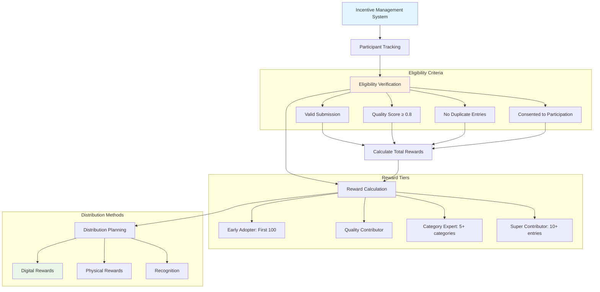

#### 5.2 Communication Templates

**Welcome Email Template:**
```html
Subject: 🎓 Welcome to LPU Student Questions Survey!

<div style="font-family: Arial, sans-serif; max-width: 600px; margin: 0 auto;">
    <h2 style="color: #2E7D32;">Thank you for joining our survey!</h2>
    
    <p>Your participation will help us create an intelligent chatbot that answers student questions instantly.</p>
    
    <div style="background-color: #E8F5E8; padding: 15px; border-radius: 5px; margin: 20px 0;">
        <h3>🎁 How to Earn Rewards:</h3>
        <ul>
            <li><strong>Early Access:</strong> First 100 participants get chatbot beta access</li>
            <li><strong>Cafe Vouchers:</strong> Win ₹500 cafe vouchers (10 winners)</li>
            <li><strong>Certificate:</strong> Digital certificate of contribution</li>
        </ul>
    </div>
    
    <p><strong>Survey Link:</strong> <a href="[FORM_LINK]" style="color: #1976D2;">Click here to start</a></p>
    
    <p>Time required: 2-3 minutes<br>
    Your responses are anonymous and will only be used to improve student services.</p>
    
    <p>Best regards,<br>
    LPU Student Services Team</p>
</div>
```

### Step 6: Progress Monitoring & Reporting

#### 6.1 Daily Progress Dashboard

```mermaid
graph TB
    Dashboard[Daily Progress Dashboard] --> KeyMetrics[Key Metrics Display]
    
    subgraph "Core Metrics"
        KeyMetrics --> TotalResponses[Total Responses]
        KeyMetrics --> DailyRate[Daily Response Rate]
        KeyMetrics --> TargetProgress[Target Progress %]
        KeyMetrics --> QualityScore[Average Quality Score]
    end
    
    subgraph "Channel Performance"
        KeyMetrics --> EmailMetrics[Email Performance]
        KeyMetrics --> WhatsAppMetrics[WhatsApp Performance]
        KeyMetrics --> SocialMetrics[Social Media Performance]
        KeyMetrics --> PhysicalMetrics[Physical Distribution]
    end
    
    subgraph "Quality Metrics"
        KeyMetrics --> CategoryDistribution[Category Distribution]
        KeyMetrics --> DepartmentCoverage[Department Coverage]
        KeyMetrics --> CompletionRate[Form Completion Rate]
        KeyMetrics --> DropoffAnalysis[Drop-off Analysis]
    end
    
    subgraph "Alert System"
        KeyMetrics --> ProgressAlerts[Progress Alerts]
        KeyMetrics --> QualityAlerts[Quality Alerts]
        KeyMetrics --> ChannelAlerts[Channel Performance Alerts]
    end
    
    style Dashboard fill:#e1f5fe
    style TotalResponses fill:#e8f5e8
    style EmailMetrics fill:#fff3e0
    style CategoryDistribution fill:#f3e5f5
    style ProgressAlerts fill:#ffcdd2
```

#### 6.2 Weekly Progress Report Template

```markdown
# LPU Query Collection - Weekly Progress Report
**Week:** [Week Number] | **Date Range:** [Start Date] - [End Date]

## 📊 Executive Summary
- **Total Responses:** [Number] / [Target]
- **Progress Percentage:** [X]%
- **Daily Average:** [X] responses/day
- **Quality Score Average:** [X.X]

## 🎯 Target Achievement
- [x] 25% Target (50 responses) - [Achieved Date]
- [x] 50% Target (100 responses) - [Achieved Date]
- [ ] 75% Target (150 responses) - [Expected Date]
- [ ] 100% Target (200 responses) - [Expected Date]

## 📈 Channel Performance
| Channel | Sent | Responses | Conversion Rate |
|---------|------|-----------|----------------|
| Email | [X] | [Y] | [Z]% |
| WhatsApp | [X] | [Y] | [Z]% |
| Social Media | [X] | [Y] | [Z]% |
| Physical | [X] | [Y] | [Z]% |

## 🏆 Top Performers
1. [Department]: [X] responses
2. [Department]: [X] responses  
3. [Department]: [X] responses

## 📋 Issues & Resolutions
- **Issue:** [Description]
- **Resolution:** [How resolved]
- **Impact:** [Effect on progress]

## 🚀 Next Week's Plan
- **Focus Areas:** [List]
- **New Initiatives:** [List]
- **Expected Outcome:** [Projection]
```

---

## 🔧 Technical Setup Requirements

### Required Tools & Accounts

| Tool/Service | Purpose | Setup Requirements |
|--------------|---------|------------------|
| Google Forms | Survey platform | Google Account |
| Google Sheets | Data collection | Linked to form |
| Email Service | Mass emailing | Access to student email database |
| WhatsApp Business | Bulk messaging | Business account setup |
| Social Media | Promotion | Admin access to LPU pages |
| Analytics | Progress tracking | Dashboard setup |

### Data Privacy & Compliance

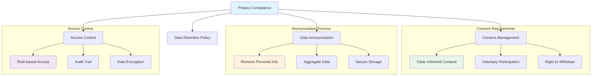

---

## ✅ Success Criteria & KPIs

### Primary Success Metrics

| Metric | Target | Measurement |
|--------|--------|-------------|
| Total Responses | 200-500 | Final count |
| Department Coverage | 100% | All programs represented |
| Category Diversity | Min 10 responses/category | Balanced distribution |
| Quality Score | >0.85 average | Automated validation |
| Completion Time | <4 weeks | Project timeline |

### Secondary Metrics

| Metric | Target | Importance |
|--------|--------|------------|
| Daily Response Rate | >15 responses/day | Consistent momentum |
| Channel Conversion | >5% average | Channel effectiveness |
| Participant Satisfaction | >4.0/5.0 | User experience |
| Data Quality Issues | <5% of total | Data reliability |

---

## 🚨 Risk Management

### Potential Risks & Mitigation

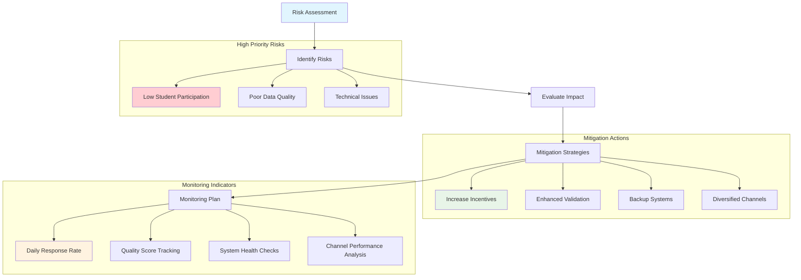

### Contingency Planning

| Scenario | Trigger | Action Plan |
|----------|---------|------------|
| Low response rate (<10/day for 3 days) | Daily monitoring | Increase incentive push, new channels |
| Technical issues with form | Error reports | Backup form ready, alternative platforms |
| Quality issues (>20% low quality) | Validation alerts | Improve form instructions, manual review |
| Privacy concerns raised | Student feedback | Immediate review, enhanced consent process |

---

## 📞 Team Coordination

### Team Roles & Responsibilities

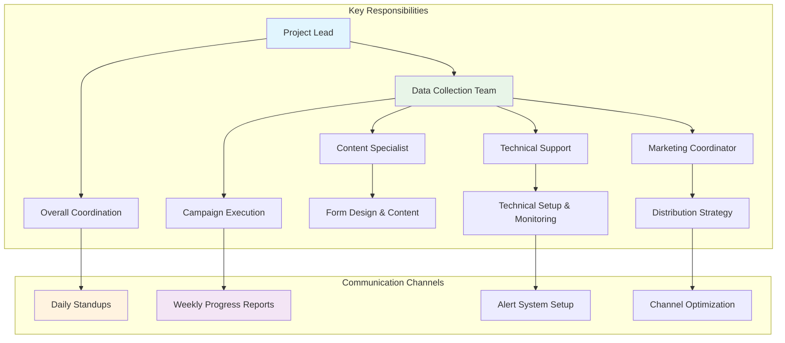

### Communication Protocol

| Meeting | Frequency | Purpose | Participants |
|----------|-----------|---------|--------------|
| Daily Standup | Daily (9 AM) | Progress update, issues | All team members |
| Weekly Review | Weekly (Friday) | Detailed analysis, planning | Project team |
| Stakeholder Update | Bi-weekly | Executive reporting | Project lead + stakeholders |
| Retrospective | End of phase | Lessons learned | All team members |

---

## 🎉 Phase Completion Checklist

### Pre-Closure Validation

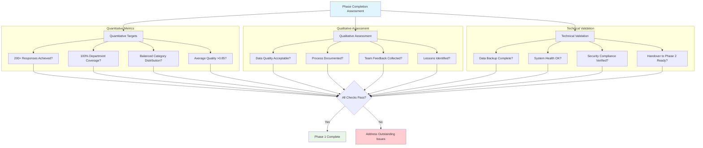

### Deliverables for Handover

- [ ] Raw dataset (CSV/Excel format)
- [ ] Cleaned and validated dataset
- [ ] Data quality report
- [ ] Campaign performance analysis
- [ ] Lessons learned document
- [ ] Process documentation
- [ ] Team feedback summary
- [ ] Risk assessment updates
- [ ] Recommendations for Phase 2

This comprehensive implementation guide ensures successful execution of Phase 1 data collection with proper planning, monitoring, and quality control measures.
