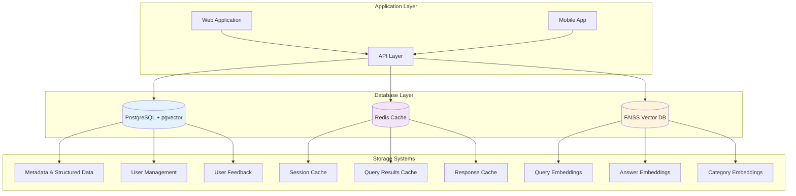
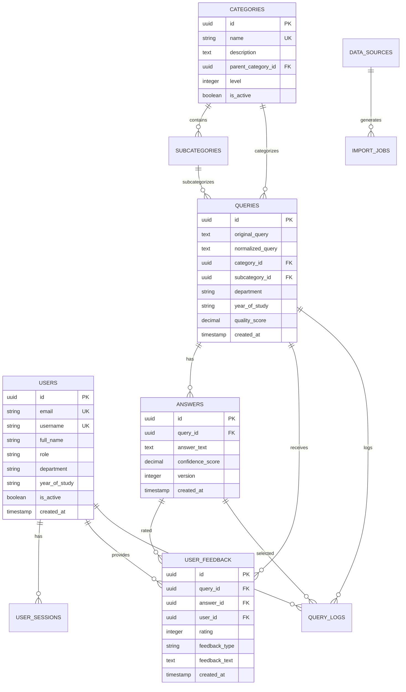

# 🗄️ Database Schema Design for LPU Query Chatbot

## 🎯 Database Architecture Overview



---

## 📊 PostgreSQL Schema Design

### Core Tables

#### 1. Queries Table
```sql
CREATE TABLE queries (
    id UUID PRIMARY KEY DEFAULT gen_random_uuid(),
    original_query TEXT NOT NULL,
    normalized_query TEXT NOT NULL,
    category_id UUID REFERENCES categories(id),
    subcategory_id UUID REFERENCES subcategories(id),
    department VARCHAR(100),
    year_of_study VARCHAR(20),
    residence_type VARCHAR(20),
    frequency VARCHAR(20),
    difficulty_level VARCHAR(20),
    embedding_id VARCHAR(255), -- Reference to FAISS vector
    quality_score DECIMAL(3,2) CHECK (quality_score >= 0 AND quality_score <= 1),
    status VARCHAR(20) DEFAULT 'active',
    created_at TIMESTAMP WITH TIME ZONE DEFAULT NOW(),
    updated_at TIMESTAMP WITH TIME ZONE DEFAULT NOW(),
    created_by UUID,
    reviewed_by UUID,
    
    -- Indexes for performance
    CONSTRAINT valid_category CHECK (category_id IS NOT NULL),
    CONSTRAINT valid_quality CHECK (quality_score IS NOT NULL)
);

-- Indexes
CREATE INDEX idx_queries_category ON queries(category_id);
CREATE INDEX idx_queries_department ON queries(department);
CREATE INDEX idx_queries_year ON queries(year_of_study);
CREATE INDEX idx_queries_status ON queries(status);
CREATE INDEX idx_queries_created_at ON queries(created_at);
CREATE INDEX idx_queries_normalized ON queries USING gin(to_tsvector('english', normalized_query));
```

#### 2. Answers Table
```sql
CREATE TABLE answers (
    id UUID PRIMARY KEY DEFAULT gen_random_uuid(),
    query_id UUID NOT NULL REFERENCES queries(id) ON DELETE CASCADE,
    answer_text TEXT NOT NULL,
    answer_type VARCHAR(50) DEFAULT 'standard',
    confidence_score DECIMAL(3,2) CHECK (confidence_score >= 0 AND confidence_score <= 1),
    embedding_id VARCHAR(255), -- Reference to FAISS vector
    status VARCHAR(20) DEFAULT 'active',
    version INTEGER DEFAULT 1,
    created_at TIMESTAMP WITH TIME ZONE DEFAULT NOW(),
    updated_at TIMESTAMP WITH TIME ZONE DEFAULT NOW(),
    created_by UUID,
    reviewed_by UUID,
    approved_at TIMESTAMP WITH TIME ZONE,
    
    -- Constraints
    CONSTRAINT valid_answer_text CHECK (LENGTH(TRIM(answer_text)) > 10),
    CONSTRAINT valid_confidence CHECK (confidence_score IS NOT NULL)
);

-- Indexes
CREATE INDEX idx_answers_query_id ON answers(query_id);
CREATE INDEX idx_answers_status ON answers(status);
CREATE INDEX idx_answers_confidence ON answers(confidence_score);
CREATE INDEX idx_answers_created_at ON answers(created_at);
```

#### 3. Categories Table
```sql
CREATE TABLE categories (
    id UUID PRIMARY KEY DEFAULT gen_random_uuid(),
    name VARCHAR(100) NOT NULL UNIQUE,
    description TEXT,
    parent_category_id UUID REFERENCES categories(id),
    level INTEGER DEFAULT 1,
    sort_order INTEGER DEFAULT 0,
    is_active BOOLEAN DEFAULT true,
    created_at TIMESTAMP WITH TIME ZONE DEFAULT NOW(),
    updated_at TIMESTAMP WITH TIME ZONE DEFAULT NOW(),
    
    CONSTRAINT valid_level CHECK (level >= 1 AND level <= 3),
    CONSTRAINT valid_name CHECK (LENGTH(TRIM(name)) > 0)
);

-- Indexes
CREATE INDEX idx_categories_parent ON categories(parent_category_id);
CREATE INDEX idx_categories_level ON categories(level);
CREATE INDEX idx_categories_active ON categories(is_active);
```

#### 4. Subcategories Table
```sql
CREATE TABLE subcategories (
    id UUID PRIMARY KEY DEFAULT gen_random_uuid(),
    category_id UUID NOT NULL REFERENCES categories(id) ON DELETE CASCADE,
    name VARCHAR(100) NOT NULL,
    description TEXT,
    sort_order INTEGER DEFAULT 0,
    is_active BOOLEAN DEFAULT true,
    created_at TIMESTAMP WITH TIME ZONE DEFAULT NOW(),
    updated_at TIMESTAMP WITH TIME ZONE DEFAULT NOW(),
    
    UNIQUE(category_id, name)
);

-- Indexes
CREATE INDEX idx_subcategories_category ON subcategories(category_id);
CREATE INDEX idx_subcategories_active ON subcategories(is_active);
```

### User Management Tables

#### 5. Users Table
```sql
CREATE TABLE users (
    id UUID PRIMARY KEY DEFAULT gen_random_uuid(),
    email VARCHAR(255) UNIQUE,
    username VARCHAR(100) UNIQUE,
    full_name VARCHAR(255),
    role VARCHAR(50) DEFAULT 'user',
    department VARCHAR(100),
    year_of_study VARCHAR(20),
    is_active BOOLEAN DEFAULT true,
    email_verified BOOLEAN DEFAULT false,
    last_login TIMESTAMP WITH TIME ZONE,
    created_at TIMESTAMP WITH TIME ZONE DEFAULT NOW(),
    updated_at TIMESTAMP WITH TIME ZONE DEFAULT NOW(),
    
    CONSTRAINT valid_role CHECK (role IN ('admin', 'moderator', 'content_manager', 'user')),
    CONSTRAINT valid_email CHECK (email ~* '^[A-Za-z0-9._%+-]+@[A-Za-z0-9.-]+\.[A-Za-z]{2,}$')
);

-- Indexes
CREATE INDEX idx_users_email ON users(email);
CREATE INDEX idx_users_username ON users(username);
CREATE INDEX idx_users_role ON users(role);
CREATE INDEX idx_users_active ON users(is_active);
```

#### 6. User Sessions Table
```sql
CREATE TABLE user_sessions (
    id UUID PRIMARY KEY DEFAULT gen_random_uuid(),
    user_id UUID REFERENCES users(id) ON DELETE CASCADE,
    session_token VARCHAR(255) UNIQUE NOT NULL,
    refresh_token VARCHAR(255) UNIQUE,
    expires_at TIMESTAMP WITH TIME ZONE NOT NULL,
    created_at TIMESTAMP WITH TIME ZONE DEFAULT NOW(),
    last_accessed TIMESTAMP WITH TIME ZONE DEFAULT NOW(),
    ip_address INET,
    user_agent TEXT,
    is_active BOOLEAN DEFAULT true,
    
    CONSTRAINT valid_expiry CHECK (expires_at > created_at)
);

-- Indexes
CREATE INDEX idx_sessions_user_id ON user_sessions(user_id);
CREATE INDEX idx_sessions_token ON user_sessions(session_token);
CREATE INDEX idx_sessions_expires ON user_sessions(expires_at);
CREATE INDEX idx_sessions_active ON user_sessions(is_active);
```

### Feedback and Analytics Tables

#### 7. User Feedback Table
```sql
CREATE TABLE user_feedback (
    id UUID PRIMARY KEY DEFAULT gen_random_uuid(),
    query_id UUID REFERENCES queries(id),
    answer_id UUID REFERENCES answers(id),
    user_id UUID REFERENCES users(id),
    session_id VARCHAR(255),
    rating INTEGER CHECK (rating >= 1 AND rating <= 5),
    feedback_type VARCHAR(50) CHECK (feedback_type IN ('helpful', 'not_helpful', 'inaccurate', 'inappropriate')),
    feedback_text TEXT,
    original_query TEXT,
    displayed_answer TEXT,
    response_time_ms INTEGER,
    created_at TIMESTAMP WITH TIME ZONE DEFAULT NOW()
);

-- Indexes
CREATE INDEX idx_feedback_query_id ON user_feedback(query_id);
CREATE INDEX idx_feedback_answer_id ON user_feedback(answer_id);
CREATE INDEX idx_feedback_user_id ON user_feedback(user_id);
CREATE INDEX idx_feedback_rating ON user_feedback(rating);
CREATE INDEX idx_feedback_created_at ON user_feedback(created_at);
```

#### 8. Query Logs Table
```sql
CREATE TABLE query_logs (
    id UUID PRIMARY KEY DEFAULT gen_random_uuid(),
    user_id UUID REFERENCES users(id),
    session_id VARCHAR(255),
    query_text TEXT NOT NULL,
    normalized_query TEXT,
    query_category VARCHAR(100),
    response_type VARCHAR(50),
    confidence_score DECIMAL(3,2),
    response_time_ms INTEGER,
    results_count INTEGER,
    selected_answer_id UUID REFERENCES answers(id),
    ip_address INET,
    user_agent TEXT,
    created_at TIMESTAMP WITH TIME ZONE DEFAULT NOW()
);

-- Partitioning for performance (by month)
CREATE TABLE query_logs_y2024m01 PARTITION OF query_logs
    FOR VALUES FROM ('2024-01-01') TO ('2024-02-01');

-- Indexes
CREATE INDEX idx_query_logs_user_id ON query_logs(user_id);
CREATE INDEX idx_query_logs_session_id ON query_logs(session_id);
CREATE INDEX idx_query_logs_created_at ON query_logs(created_at);
CREATE INDEX idx_query_logs_category ON query_logs(query_category);
```

#### 9. System Metrics Table
```sql
CREATE TABLE system_metrics (
    id UUID PRIMARY KEY DEFAULT gen_random_uuid(),
    metric_name VARCHAR(100) NOT NULL,
    metric_value DECIMAL(15,4),
    metric_unit VARCHAR(50),
    tags JSONB,
    created_at TIMESTAMP WITH TIME ZONE DEFAULT NOW(),
    
    CONSTRAINT valid_metric_name CHECK (LENGTH(TRIM(metric_name)) > 0)
);

-- Indexes
CREATE INDEX idx_metrics_name ON system_metrics(metric_name);
CREATE INDEX idx_metrics_created_at ON system_metrics(created_at);
CREATE INDEX idx_metrics_tags ON system_metrics USING gin(tags);
```

### Administration Tables

#### 10. Data Sources Table
```sql
CREATE TABLE data_sources (
    id UUID PRIMARY KEY DEFAULT gen_random_uuid(),
    name VARCHAR(100) NOT NULL UNIQUE,
    type VARCHAR(50) NOT NULL,
    description TEXT,
    configuration JSONB,
    is_active BOOLEAN DEFAULT true,
    last_sync TIMESTAMP WITH TIME ZONE,
    created_at TIMESTAMP WITH TIME ZONE DEFAULT NOW(),
    updated_at TIMESTAMP WITH TIME ZONE DEFAULT NOW(),
    
    CONSTRAINT valid_source_type CHECK (type IN ('google_form', 'manual', 'api', 'import'))
);

-- Indexes
CREATE INDEX idx_data_sources_type ON data_sources(type);
CREATE INDEX idx_data_sources_active ON data_sources(is_active);
```

#### 11. Import Jobs Table
```sql
CREATE TABLE import_jobs (
    id UUID PRIMARY KEY DEFAULT gen_random_uuid(),
    data_source_id UUID REFERENCES data_sources(id),
    job_name VARCHAR(255) NOT NULL,
    status VARCHAR(50) DEFAULT 'pending',
    total_records INTEGER DEFAULT 0,
    processed_records INTEGER DEFAULT 0,
    failed_records INTEGER DEFAULT 0,
    error_details JSONB,
    started_at TIMESTAMP WITH TIME ZONE,
    completed_at TIMESTAMP WITH TIME ZONE,
    created_at TIMESTAMP WITH TIME ZONE DEFAULT NOW(),
    
    CONSTRAINT valid_status CHECK (status IN ('pending', 'running', 'completed', 'failed', 'cancelled'))
);

-- Indexes
CREATE INDEX idx_import_jobs_source ON import_jobs(data_source_id);
CREATE INDEX idx_import_jobs_status ON import_jobs(status);
CREATE INDEX idx_import_jobs_created_at ON import_jobs(created_at);
```

---

## 🔍 Vector Database Schema (FAISS)

### Vector Index Structure

```python
# FAISS Index Configuration
import faiss
import numpy as np

class LPUVectorIndex:
    def __init__(self, dimension=384):
        self.dimension = dimension
        
        # Main query index
        self.query_index = faiss.IndexIVFFlat(
            faiss.IndexFlatL2(dimension), 
            dimension, 
            nlist=100
        )
        
        # Answer index
        self.answer_index = faiss.IndexIVFFlat(
            faiss.IndexFlatL2(dimension), 
            dimension, 
            nlist=100
        )
        
        # Category index
        self.category_index = faiss.IndexFlatL2(dimension)
        
        # Metadata storage
        self.query_metadata = {}
        self.answer_metadata = {}
        self.category_metadata = {}
    
    def train_index(self, training_data):
        """Train the FAISS indexes"""
        self.query_index.train(training_data)
        self.answer_index.train(training_data)
    
    def add_query_vectors(self, vectors, metadata):
        """Add query vectors to index"""
        self.query_index.add(vectors)
        for i, meta in enumerate(metadata):
            self.query_metadata[len(self.query_metadata) + i] = meta
    
    def add_answer_vectors(self, vectors, metadata):
        """Add answer vectors to index"""
        self.answer_index.add(vectors)
        for i, meta in enumerate(metadata):
            self.answer_metadata[len(self.answer_metadata) + i] = meta
```

### Vector Storage Schema

```json
{
  "vector_schema": {
    "queries": {
      "dimension": 384,
      "index_type": "IVF_FLAT",
      "metric": "L2",
      "nlist": 100,
      "nprobe": 10
    },
    "answers": {
      "dimension": 384,
      "index_type": "IVF_FLAT", 
      "metric": "L2",
      "nlist": 100,
      "nprobe": 10
    },
    "categories": {
      "dimension": 384,
      "index_type": "FLAT",
      "metric": "L2"
    }
  },
  "metadata_schema": {
    "query_metadata": {
      "id": "UUID",
      "text": "string",
      "category": "string",
      "department": "string",
      "year": "string",
      "created_at": "timestamp"
    },
    "answer_metadata": {
      "id": "UUID",
      "query_id": "UUID",
      "text": "string",
      "confidence": "float",
      "created_at": "timestamp"
    }
  }
}
```

---

## 🗃️ Redis Cache Schema

### Cache Keys Structure

```python
# Redis Key Naming Convention
REDIS_KEYS = {
    # Query caching
    "query:{query_hash}": {
        "ttl": 3600,  # 1 hour
        "structure": "hash",
        "fields": ["answer", "confidence", "category", "timestamp"]
    },
    
    # Session caching
    "session:{session_id}": {
        "ttl": 86400,  # 24 hours
        "structure": "hash",
        "fields": ["user_id", "created_at", "last_activity", "query_count"]
    },
    
    # Popular queries
    "popular_queries:category:{category}": {
        "ttl": 1800,  # 30 minutes
        "structure": "zset",
        "score": "frequency"
    },
    
    # Rate limiting
    "rate_limit:user:{user_id}": {
        "ttl": 3600,  # 1 hour
        "structure": "string",
        "value": "request_count"
    },
    
    # System metrics
    "metrics:hourly:{timestamp}": {
        "ttl": 2592000,  # 30 days
        "structure": "hash",
        "fields": ["query_count", "avg_response_time", "cache_hits"]
    }
}
```

### Cache Implementation

```python
import redis
import json
import hashlib

class LPUQueryCache:
    def __init__(self, redis_client):
        self.redis = redis_client
        
    def cache_query_result(self, query, answer, confidence, category):
        """Cache query result"""
        query_hash = self._hash_query(query)
        key = f"query:{query_hash}"
        
        data = {
            "answer": answer,
            "confidence": str(confidence),
            "category": category,
            "timestamp": str(int(time.time()))
        }
        
        self.redis.hmset(key, data)
        self.redis.expire(key, 3600)  # 1 hour TTL
        
        return query_hash
    
    def get_cached_result(self, query):
        """Get cached query result"""
        query_hash = self._hash_query(query)
        key = f"query:{query_hash}"
        
        data = self.redis.hgetall(key)
        if data:
            return {
                "answer": data.get("answer"),
                "confidence": float(data.get("confidence", 0)),
                "category": data.get("category"),
                "timestamp": int(data.get("timestamp", 0))
            }
        return None
    
    def _hash_query(self, query):
        """Generate hash for query"""
        return hashlib.md5(query.encode()).hexdigest()
```

---

## 🔄 Database Relationships

### Entity Relationship Diagram



---

## 📈 Performance Optimization

### Indexing Strategy

```sql
-- Composite indexes for common queries
CREATE INDEX idx_queries_category_status ON queries(category_id, status);
CREATE INDEX idx_queries_department_year ON queries(department, year_of_study);
CREATE INDEX idx_feedback_query_answer ON user_feedback(query_id, answer_id);
CREATE INDEX idx_logs_user_created ON query_logs(user_id, created_at DESC);

-- Partial indexes for performance
CREATE INDEX idx_active_queries ON queries(created_at) WHERE status = 'active';
CREATE INDEX idx_recent_feedback ON user_feedback(created_at) WHERE rating IS NOT NULL;
CREATE INDEX idx_high_quality ON queries(quality_score) WHERE quality_score >= 0.8;
```

### Partitioning Strategy

```sql
-- Partition query_logs by month for better performance
CREATE TABLE query_logs (
    id UUID PRIMARY KEY DEFAULT gen_random_uuid(),
    user_id UUID REFERENCES users(id),
    query_text TEXT NOT NULL,
    created_at TIMESTAMP WITH TIME ZONE DEFAULT NOW()
) PARTITION BY RANGE (created_at);

-- Create monthly partitions
CREATE TABLE query_logs_y2024m01 PARTITION OF query_logs
    FOR VALUES FROM ('2024-01-01') TO ('2024-02-01');

CREATE TABLE query_logs_y2024m02 PARTITION OF query_logs
    FOR VALUES FROM ('2024-02-01') TO ('2024-03-01');

-- Automatic partition creation function
CREATE OR REPLACE FUNCTION create_monthly_partition(table_name text, start_date date)
RETURNS void AS $$
DECLARE
    partition_name text;
    end_date date;
BEGIN
    partition_name := table_name || '_y' || to_char(start_date, 'YYYY') || 'm' || to_char(start_date, 'MM');
    end_date := start_date + interval '1 month';
    
    EXECUTE format('CREATE TABLE %I PARTITION OF %I FOR VALUES FROM (%L) TO (%L)',
                   partition_name, table_name, start_date, end_date);
END;
$$ LANGUAGE plpgsql;
```

---

## 🔒 Security Considerations

### Data Encryption

```sql
-- Enable row-level security for sensitive data
ALTER TABLE users ENABLE ROW LEVEL SECURITY;
ALTER TABLE user_sessions ENABLE ROW LEVEL SECURITY;
ALTER TABLE user_feedback ENABLE ROW LEVEL SECURITY;

-- RLS Policies
CREATE POLICY user_data_policy ON users
    FOR ALL TO authenticated_user
    USING (id = current_setting('app.current_user_id')::uuid OR 
           current_setting('app.user_role') = 'admin');

CREATE POLICY feedback_policy ON user_feedback
    FOR ALL TO authenticated_user
    USING (user_id = current_setting('app.current_user_id')::uuid OR 
           current_setting('app.user_role') IN ('admin', 'moderator'));
```

### Access Control

```sql
-- Create roles with specific permissions
CREATE ROLE app_user WITH LOGIN PASSWORD 'secure_password';
CREATE ROLE app_admin WITH LOGIN PASSWORD 'admin_password';
CREATE ROLE read_only_user WITH LOGIN PASSWORD 'read_password';

-- Grant permissions
GRANT SELECT, INSERT, UPDATE, DELETE ON ALL TABLES IN SCHEMA public TO app_admin;
GRANT SELECT, INSERT, UPDATE ON queries, answers, user_feedback TO app_user;
GRANT SELECT ON ALL TABLES IN SCHEMA public TO read_only_user;

-- Revoke sensitive access
REVOKE SELECT ON users FROM read_only_user;
REVOKE SELECT ON user_sessions FROM read_only_user;
```

---

## 📊 Backup & Recovery

### Backup Strategy

```bash
#!/bin/bash
# Database backup script

# PostgreSQL backup
pg_dump -h localhost -U postgres -d lpu_chatbot \
    --format=custom \
    --compress=9 \
    --file="/backups/postgres/lpu_chatbot_$(date +%Y%m%d_%H%M%S).backup"

# FAISS index backup
python backup_faiss.py --source /data/faiss --destination /backups/faiss/$(date +%Y%m%d_%H%M%S)

# Redis backup
redis-cli --rdb "/backups/redis/redis_$(date +%Y%m%d_%H%M%S).rdb"

# Cleanup old backups (keep 30 days)
find /backups -type f -mtime +30 -delete
```

### Recovery Procedures

```sql
-- Point-in-time recovery setup
-- Enable WAL archiving
archive_mode = on
archive_command = 'cp %p /backup/wal_archive/%f'
wal_level = replica

-- Recovery script
pg_ctl start -D /var/lib/postgresql/data -l recovery.log &
-- Restore from backup if needed
pg_restore -h localhost -U postgres -d lpu_chatbot \
    --clean --if-exists \
    /backups/postgres/lpu_chatbot_backup.backup
```

This comprehensive database schema provides a robust foundation for the LPU Query Chatbot system with proper indexing, security, and performance optimization strategies.
